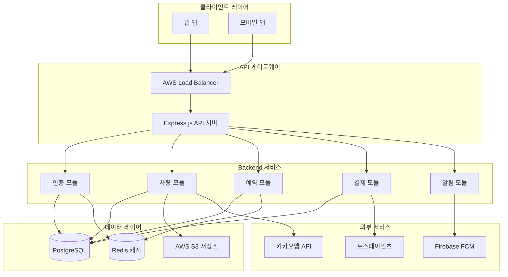
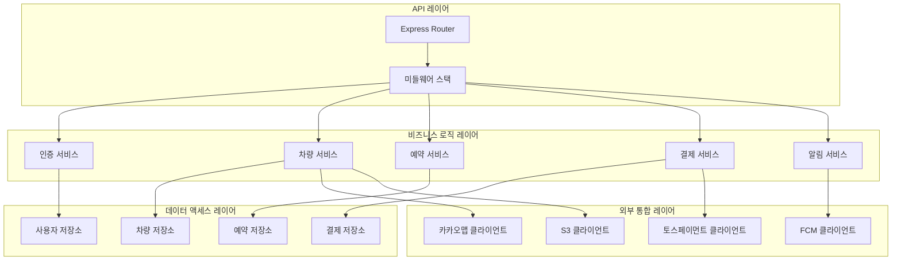
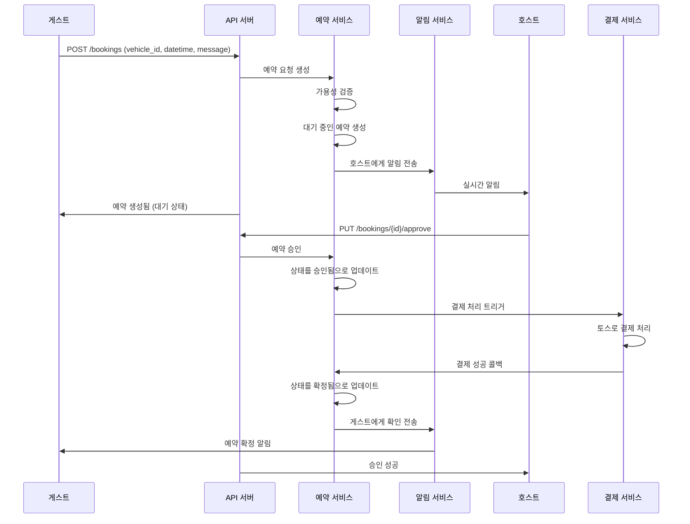
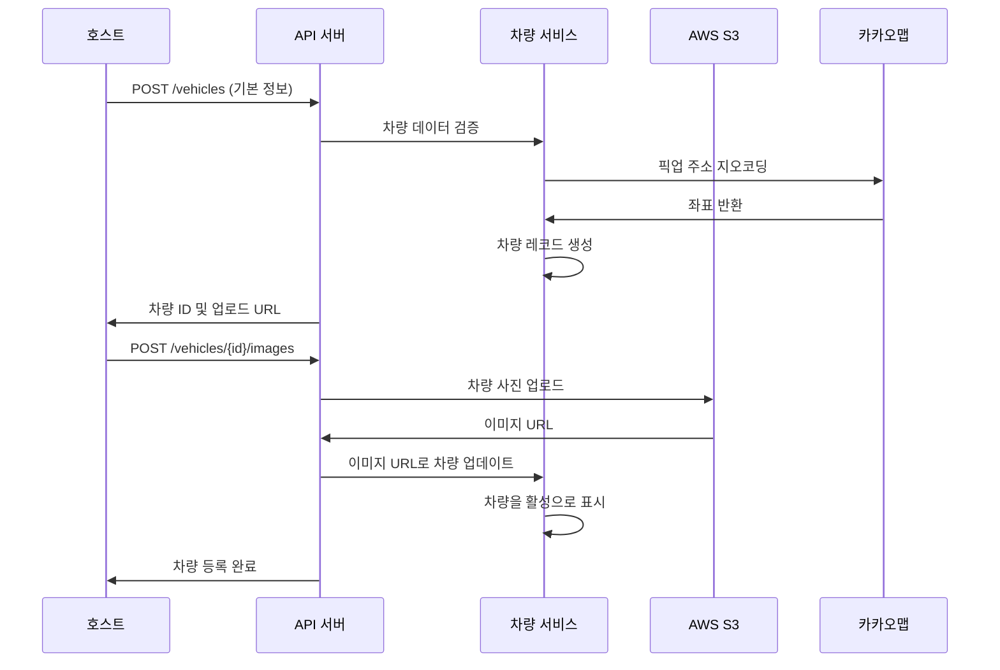

# 카셰어링 서비스 Backend Architecture Document

## 소개

이 문서는 카셰어링 서비스의 backend 아키텍처를 설명하며, B2B/B2C 하이브리드 카셰어링 플랫폼의 backend 개발에 대한 결정적인 가이드 역할을 합니다. AI 기반 backend 개발의 일관성과 선택된 패턴 및 기술에 대한 준수를 보장합니다.

**Frontend Architecture와의 관계:**
이 backend 아키텍처는 Frontend Architecture Document와 함께 사용되어야 합니다. 여기에 문서화된 기술 스택 선택은 전체 프로젝트의 결정적인 기준입니다.

### 시작 템플릿 또는 기존 프로젝트

**결정**: 현대적인 Node.js/TypeScript backend를 사용한 새로운 프로젝트
- 상속받을 기존 backend 코드베이스 없음
- 검증된 패턴을 사용한 클린 아키텍처 접근
- 초기 MVP를 위한 모듈형 모놀리스 설계로 마이크로서비스 준비 완료

### 변경 이력

| 날짜 | 버전 | 설명 | 작성자 |
|------|---------|-------------|---------|
| 2025-09-20 | v1.0 | 초기 backend 아키텍처 생성 | System Architect |

## 고수준 아키텍처

### 기술 요약

Backend는 AWS에 배포된 모듈형 모놀리스 아키텍처를 사용하며, 타입 안전성을 위한 TypeScript와 HTTP 처리를 위한 Express.js가 포함된 Node.js를 활용합니다. 시스템은 PostgreSQL을 주 데이터베이스로 사용하고 Redis를 캐싱 및 세션 관리에 사용합니다. 아키텍처는 WebSocket 연결을 통한 실시간 기능을 지원하며 한국 시장 서비스(카카오맵, 토스페이먼츠)와 원활하게 통합됩니다. JWT 기반 인증은 하이브리드 B2B/B2C 사용자 모델을 위한 안전한 액세스 제어를 제공하며, 모듈형 설계로 향후 마이크로서비스 마이그레이션을 가능하게 합니다.

### 고수준 개요

**아키텍처 스타일**: 모듈형 모놀리스
- **저장소 구조**: npm workspaces를 사용한 모노레포
- **서비스 아키텍처**: 명확한 모듈 경계를 가진 단일 배포 가능한 애플리케이션
- **사용자 상호작용 흐름**: 실시간 WebSocket 업데이트가 포함된 REST API 엔드포인트
- **주요 결정사항**:
  - 모듈형 모놀리스는 마이크로서비스 마이그레이션 경로를 유지하면서 더 빠른 초기 개발을 제공
  - 타입 안전성과 더 나은 개발자 경험을 위한 전체 TypeScript 사용
  - 느슨한 결합을 위한 모듈 내 이벤트 기반 아키텍처

### 고수준 프로젝트 다이어그램



### 아키텍처 및 설계 패턴

- **모듈형 모놀리스 패턴**: 향후 마이크로서비스 추출 가능성과 함께 명확한 모듈 경계 - *근거*: 아키텍처 유연성을 유지하면서 더 빠른 개발 및 배포
- **저장소 패턴**: 인터페이스 뒤에 데이터 액세스 로직 추상화 - *근거*: 테스트 및 향후 데이터베이스 마이그레이션 유연성 제공
- **이벤트 기반 통신**: 모듈 통신을 위한 내부 이벤트 버스 - *근거*: 모듈 간 결합도 감소 및 비동기 처리 지원
- **API 게이트웨이 패턴**: 모든 API 요청의 단일 진입점 - *근거*: 중앙화된 인증, 속도 제한 및 모니터링
- **CQRS 패턴**: 복잡한 비즈니스 로직을 위한 읽기 및 쓰기 작업 분리 - *근거*: 예약 쿼리 대 명령에 대한 성능 최적화

## 기술 스택

### 클라우드 인프라

- **제공업체**: AWS
- **주요 서비스**: EC2, RDS, ElastiCache, S3, CloudWatch, Application Load Balancer
- **배포 지역**: ap-northeast-2 (서울)

### 기술 스택 테이블

| 카테고리 | 기술 | 버전 | 목적 | 근거 |
|----------|------------|---------|---------|-----------|
| **언어** | TypeScript | 5.3.3 | 주요 개발 언어 | 강력한 타이핑, 뛰어난 도구, 팀 전문성 |
| **런타임** | Node.js | 20.11.0 | JavaScript 런타임 | LTS 버전, 안정적인 성능, 광범위한 생태계 |
| **프레임워크** | Express.js | 4.18.2 | 웹 애플리케이션 프레임워크 | 성숙함, 유연함, 뛰어난 미들웨어 생태계 |
| **데이터베이스** | PostgreSQL | 15.5 | 주 데이터베이스 | ACID 준수, JSON 지원, 뛰어난 성능 |
| **캐시** | Redis | 7.2.3 | 캐싱 및 세션 저장소 | 빠른 인메모리 작업, pub/sub 기능 |
| **ORM** | Prisma | 5.7.1 | 데이터베이스 ORM | 타입 안전 쿼리, 마이그레이션, 뛰어난 TypeScript 통합 |
| **인증** | JWT | jsonwebtoken@9.0.2 | 무상태 인증 | 확장 가능, 안전, SPA와 잘 작동 |
| **검증** | Joi | 17.11.0 | 입력 검증 | 포괄적인 검증 규칙, 좋은 TypeScript 지원 |
| **테스팅** | Jest | 29.7.0 | 단위 및 통합 테스팅 | 포괄적인 테스팅 프레임워크, 훌륭한 TypeScript 지원 |
| **WebSocket** | Socket.io | 4.7.4 | 실시간 통신 | 신뢰할 수 있는 실시간 기능, 폴백 지원 |
| **파일 업로드** | Multer | 1.4.5 | 멀티파트 폼 처리 | 표준 Express.js 파일 업로드 미들웨어 |
| **보안** | Helmet | 7.1.0 | 보안 헤더 | Express를 위한 필수 보안 미들웨어 |
| **로깅** | Winston | 3.11.0 | 구조화된 로깅 | 여러 전송과 함께 포괄적인 로깅 |
| **프로세스 관리자** | PM2 | 5.3.0 | 프로덕션 프로세스 관리 | 무중단 배포, 클러스터 모드 |

## 데이터 모델

### User

**목적**: 호스트(법인 사용자)와 게스트(개인 사용자) 모두를 지원하는 핵심 사용자 엔티티

**주요 속성**:
- id: UUID - 고유 식별자
- email: string - 로그인 자격증명 및 통신
- password_hash: string - 안전한 비밀번호 저장
- name: string - 표시 이름
- phone: string - 연락처 및 인증
- role: enum - USER_TYPE (guest, host, admin)
- profile_image_url: string? - 선택적 프로필 사진
- is_verified: boolean - 이메일 인증 상태
- created_at: timestamp - 계정 생성 시간
- updated_at: timestamp - 마지막 수정 시간

**관계**:
- 보유: 차량들 (호스트인 경우), 예약들 (게스트인 경우), 작성한_리뷰들, 받은_리뷰들
- 소속: 법인_프로필 (호스트인 경우)

### CorporateProfile

**목적**: 법인 호스트(법인차 소유자)를 위한 추가 프로필 정보

**주요 속성**:
- id: UUID - 고유 식별자
- user_id: UUID - User 참조
- company_name: string - 법적 회사명
- business_registration_number: string - 사업자등록번호
- tax_id: string - 세무 처리용 식별자
- is_verified: boolean - 법인 인증 상태
- verification_documents: JSON - 업로드된 문서 참조

**관계**:
- 소속: User
- 보유: Vehicles

### Vehicle

**목적**: 플랫폼에서 공유할 수 있는 자동차를 나타냄

**주요 속성**:
- id: UUID - 고유 식별자
- owner_id: UUID - User(호스트) 참조
- license_plate: string - 차량 번호판
- make: string - 제조사 (예: "Genesis")
- model: string - 모델명 (예: "G90")
- year: integer - 연식
- color: string - 차량 색상
- fuel_type: enum - FUEL_TYPE (gasoline, diesel, electric, hybrid)
- transmission: enum - TRANSMISSION (manual, automatic)
- hourly_rate: decimal - 시간당 대여료
- location_address: string - 픽업 위치 주소
- location_lat: decimal - GPS 위도
- location_lng: decimal - GPS 경도
- status: enum - VEHICLE_STATUS (active, inactive, maintenance)
- images: JSON array - S3 이미지 URL 배열
- description: text - 차량 설명
- created_at: timestamp
- updated_at: timestamp

**관계**:
- 소속: User (소유자)
- 보유: Bookings, VehicleAvailabilities, Reviews

### VehicleAvailability

**목적**: 차량이 예약 가능한 시간대를 관리

**주요 속성**:
- id: UUID - 고유 식별자
- vehicle_id: UUID - Vehicle 참조
- day_of_week: integer - 요일 (0=일요일, 6=토요일)
- start_time: time - 시작 시간
- end_time: time - 종료 시간
- is_recurring: boolean - 반복 일정 여부
- specific_date: date? - 특정 날짜 (비반복 일정용)
- is_blocked: boolean - 차단된 시간대 여부

**관계**:
- 소속: Vehicle

### Booking

**목적**: 자동차 대여 예약 및 라이프사이클을 나타냄

**주요 속성**:
- id: UUID - 고유 식별자
- vehicle_id: UUID - Vehicle 참조
- guest_id: UUID - User(게스트) 참조
- host_id: UUID - User(호스트) 참조
- start_datetime: timestamp - 대여 시작 시간
- end_datetime: timestamp - 대여 종료 시간
- total_amount: decimal - 총 결제 금액
- platform_fee: decimal - 플랫폼 수수료 (15%)
- status: enum - BOOKING_STATUS (pending, approved, rejected, active, completed, cancelled)
- guest_message: text? - 게스트 메시지
- host_response: text? - 호스트 응답
- pickup_photos: JSON array - 인수 시 사진
- return_photos: JSON array - 반납 시 사진
- created_at: timestamp
- updated_at: timestamp

**관계**:
- 소속: Vehicle, User(게스트), User(호스트)
- 보유: Payment
- 보유: Reviews

### Payment

**목적**: 결제 거래 및 정산 추적

**주요 속성**:
- id: UUID - 고유 식별자
- booking_id: UUID - Booking 참조
- amount: decimal - 결제 금액
- platform_fee: decimal - 플랫폼 수수료
- host_amount: decimal - 호스트 수익 (85%)
- payment_method: string - 결제 수단
- toss_payment_key: string - 토스페이먼츠 거래 키
- status: enum - PAYMENT_STATUS (pending, completed, failed, refunded)
- paid_at: timestamp? - 결제 완료 시간
- settled_at: timestamp? - 정산 완료 시간

**관계**:
- 소속: Booking

### Review

**목적**: 신뢰 구축을 위한 사용자 피드백 및 평점 시스템

**주요 속성**:
- id: UUID - 고유 식별자
- booking_id: UUID - Booking 참조
- reviewer_id: UUID - User(리뷰어) 참조
- reviewee_id: UUID - User(리뷰 대상) 참조
- rating: integer - 평점 (1-5)
- category_ratings: JSON - 세부 평점 (청결도, 시간준수, 매너)
- comment: text? - 리뷰 내용
- is_recommended: boolean - 추천 여부
- created_at: timestamp

**관계**:
- 소속: Booking, User(리뷰어), User(리뷰 대상)

## 컴포넌트

### 인증 모듈

**책임**: 사용자 인증, 인가 및 세션 관리

**주요 인터페이스**:
- POST /auth/register - 사용자 등록
- POST /auth/login - 사용자 인증
- POST /auth/refresh - 토큰 갱신
- POST /auth/logout - 세션 종료
- GET /auth/me - 현재 사용자 프로필

**의존성**: PostgreSQL (사용자 데이터), Redis (세션 저장), JWT 라이브러리

**기술 스택**: Express.js 라우트, 비밀번호 해싱용 bcrypt, 토큰용 JWT, Joi 검증

### 차량 관리 모듈

**책임**: 차량 등록, 가용성 관리 및 검색 기능

**주요 인터페이스**:
- POST /vehicles - 새 차량 등록
- GET /vehicles - 이용 가능한 차량 검색
- GET /vehicles/:id - 차량 세부사항
- PUT /vehicles/:id - 차량 정보 업데이트
- DELETE /vehicles/:id - 차량 제거
- POST /vehicles/:id/availability - 가용성 일정 관리

**의존성**: PostgreSQL (차량 데이터), S3 (이미지 저장), 카카오맵 API (위치 서비스)

**기술 스택**: Express.js 라우트, 파일 업로드용 Multer, S3용 AWS SDK

### 예약 관리 모듈

**책임**: 예약 라이프사이클, 승인 워크플로 및 실시간 업데이트

**주요 인터페이스**:
- POST /bookings - 예약 요청 생성
- GET /bookings - 사용자 예약 목록
- PUT /bookings/:id/approve - 호스트 승인
- PUT /bookings/:id/reject - 호스트 거부
- PUT /bookings/:id/cancel - 예약 취소
- POST /bookings/:id/photos - 픽업/반납 사진 업로드

**의존성**: PostgreSQL (예약 데이터), Redis (실시간 상태), WebSocket (알림)

**기술 스택**: Express.js 라우트, 실시간 업데이트용 Socket.io, 사진 업로드용 Multer

### 결제 처리 모듈

**책임**: 결제 처리, 정산 및 재무 보고

**주요 인터페이스**:
- POST /payments/process - 결제 처리
- GET /payments/history - 결제 내역
- POST /payments/settle - 정산 트리거
- GET /payments/settlements - 정산 보고서
- POST /payments/webhook - 토스페이먼츠 웹훅

**의존성**: 토스페이먼츠 API, PostgreSQL (결제 데이터)

**기술 스택**: Express.js 라우트, 토스페이먼츠 SDK, 웹훅 검증

### 알림 모듈

**책임**: 실시간 알림 및 통신

**주요 인터페이스**:
- 실시간 업데이트를 위한 WebSocket 연결
- POST /notifications/send - 알림 전송
- GET /notifications - 사용자 알림 내역
- PUT /notifications/:id/read - 읽음 표시

**의존성**: Firebase FCM (푸시 알림), Socket.io (실시간), Redis (pub/sub)

**기술 스택**: Socket.io 서버, Firebase Admin SDK, Redis pub/sub

### 컴포넌트 다이어그램



## 외부 API

### 카카오맵 API

- **목적**: 위치 서비스, 지오코딩 및 지도 표시
- **문서**: https://developers.kakao.com/docs/latest/ko/local/dev-guide
- **기본 URL**: https://dapi.kakao.com
- **인증**: Authorization 헤더의 REST API Key
- **속도 제한**: 100,000 요청/일 (무료 계층)

**사용하는 주요 엔드포인트**:
- `GET /v2/local/search/address.json` - 주소를 좌표로 변환
- `GET /v2/local/geo/coord2address.json` - 좌표를 주소로 변환

**통합 참고사항**: 차량 위치 검증 및 검색 반경 계산에 사용

### 토스페이먼츠 API

- **목적**: 카셰어링 거래를 위한 결제 처리 및 정산
- **문서**: https://docs.tosspayments.com/reference
- **기본 URL**: https://api.tosspayments.com
- **인증**: 비밀 키가 포함된 Bearer 토큰
- **속도 제한**: 특정 제한 없음

**사용하는 주요 엔드포인트**:
- `POST /v1/payments` - 결제 처리
- `GET /v1/payments/{paymentKey}` - 결제 상태 조회
- `POST /v1/payments/{paymentKey}/cancel` - 결제 취소

**통합 참고사항**: 결제 상태 업데이트를 위한 웹훅 엔드포인트 필요, 15% 플랫폼 수수료 처리

### Firebase Cloud Messaging API

- **목적**: 예약 업데이트 및 실시간 알림을 위한 푸시 알림
- **문서**: https://firebase.google.com/docs/cloud-messaging
- **기본 URL**: https://fcm.googleapis.com
- **인증**: 서비스 계정 키
- **속도 제한**: 1,000,000 메시지/월 (무료 계층)

**사용하는 주요 엔드포인트**:
- `POST /v1/projects/{project-id}/messages:send` - 알림 전송

**통합 참고사항**: 사용자 지정 데이터 페이로드를 사용한 iOS 및 Android 푸시 알림 지원

## 핵심 워크플로

### 예약 생성 및 승인 워크플로



### 차량 등록 워크플로



## REST API 사양

```yaml
openapi: 3.0.0
info:
  title: 카셰어링 서비스 API
  version: 1.0.0
  description: 법인 및 개인 사용자를 위한 카셰어링 플랫폼 API
servers:
  - url: https://api.carshare.co.kr/v1
    description: 프로덕션 서버
  - url: https://api-staging.carshare.co.kr/v1
    description: 스테이징 서버

paths:
  /auth/register:
    post:
      summary: 사용자 등록
      requestBody:
        required: true
        content:
          application/json:
            schema:
              type: object
              required: [email, password, name, phone, role]
              properties:
                email:
                  type: string
                  format: email
                password:
                  type: string
                  minLength: 8
                name:
                  type: string
                phone:
                  type: string
                role:
                  type: string
                  enum: [guest, host]
      responses:
        '201':
          description: 사용자가 성공적으로 생성됨
          content:
            application/json:
              schema:
                $ref: '#/components/schemas/AuthResponse'

  /auth/login:
    post:
      summary: 사용자 인증
      requestBody:
        required: true
        content:
          application/json:
            schema:
              type: object
              required: [email, password]
              properties:
                email:
                  type: string
                  format: email
                password:
                  type: string
      responses:
        '200':
          description: 로그인 성공
          content:
            application/json:
              schema:
                $ref: '#/components/schemas/AuthResponse'

  /vehicles:
    get:
      summary: 이용 가능한 차량 검색
      parameters:
        - name: lat
          in: query
          required: true
          schema:
            type: number
        - name: lng
          in: query
          required: true
          schema:
            type: number
        - name: start_datetime
          in: query
          required: true
          schema:
            type: string
            format: date-time
        - name: end_datetime
          in: query
          required: true
          schema:
            type: string
            format: date-time
        - name: radius
          in: query
          schema:
            type: number
            default: 5
      responses:
        '200':
          description: 이용 가능한 차량들
          content:
            application/json:
              schema:
                type: array
                items:
                  $ref: '#/components/schemas/Vehicle'

    post:
      summary: 새 차량 등록
      security:
        - bearerAuth: []
      requestBody:
        required: true
        content:
          application/json:
            schema:
              $ref: '#/components/schemas/VehicleCreate'
      responses:
        '201':
          description: 차량이 성공적으로 생성됨
          content:
            application/json:
              schema:
                $ref: '#/components/schemas/Vehicle'

  /bookings:
    get:
      summary: 사용자 예약 조회
      security:
        - bearerAuth: []
      parameters:
        - name: status
          in: query
          schema:
            type: string
            enum: [pending, approved, active, completed, cancelled]
      responses:
        '200':
          description: 사용자 예약들
          content:
            application/json:
              schema:
                type: array
                items:
                  $ref: '#/components/schemas/Booking'

    post:
      summary: 예약 요청 생성
      security:
        - bearerAuth: []
      requestBody:
        required: true
        content:
          application/json:
            schema:
              $ref: '#/components/schemas/BookingCreate'
      responses:
        '201':
          description: 예약이 성공적으로 생성됨
          content:
            application/json:
              schema:
                $ref: '#/components/schemas/Booking'

components:
  securitySchemes:
    bearerAuth:
      type: http
      scheme: bearer
      bearerFormat: JWT

  schemas:
    AuthResponse:
      type: object
      properties:
        access_token:
          type: string
        refresh_token:
          type: string
        user:
          $ref: '#/components/schemas/User'

    User:
      type: object
      properties:
        id:
          type: string
          format: uuid
        email:
          type: string
          format: email
        name:
          type: string
        phone:
          type: string
        role:
          type: string
          enum: [guest, host, admin]
        profile_image_url:
          type: string
        is_verified:
          type: boolean
        created_at:
          type: string
          format: date-time

    Vehicle:
      type: object
      properties:
        id:
          type: string
          format: uuid
        license_plate:
          type: string
        make:
          type: string
        model:
          type: string
        year:
          type: integer
        hourly_rate:
          type: number
        location_address:
          type: string
        location_lat:
          type: number
        location_lng:
          type: number
        images:
          type: array
          items:
            type: string
        owner:
          $ref: '#/components/schemas/User'

    VehicleCreate:
      type: object
      required: [license_plate, make, model, year, hourly_rate, location_address]
      properties:
        license_plate:
          type: string
        make:
          type: string
        model:
          type: string
        year:
          type: integer
        color:
          type: string
        fuel_type:
          type: string
          enum: [gasoline, diesel, electric, hybrid]
        transmission:
          type: string
          enum: [manual, automatic]
        hourly_rate:
          type: number
        location_address:
          type: string
        description:
          type: string

    Booking:
      type: object
      properties:
        id:
          type: string
          format: uuid
        vehicle:
          $ref: '#/components/schemas/Vehicle'
        guest:
          $ref: '#/components/schemas/User'
        start_datetime:
          type: string
          format: date-time
        end_datetime:
          type: string
          format: date-time
        total_amount:
          type: number
        status:
          type: string
          enum: [pending, approved, rejected, active, completed, cancelled]
        guest_message:
          type: string
        created_at:
          type: string
          format: date-time

    BookingCreate:
      type: object
      required: [vehicle_id, start_datetime, end_datetime]
      properties:
        vehicle_id:
          type: string
          format: uuid
        start_datetime:
          type: string
          format: date-time
        end_datetime:
          type: string
          format: date-time
        guest_message:
          type: string
```

## 데이터베이스 스키마

```sql
-- 사용자 인증 및 프로필
CREATE TABLE users (
    id UUID PRIMARY KEY DEFAULT gen_random_uuid(),
    email VARCHAR(255) UNIQUE NOT NULL,
    password_hash VARCHAR(255) NOT NULL,
    name VARCHAR(100) NOT NULL,
    phone VARCHAR(20) NOT NULL,
    role VARCHAR(20) NOT NULL CHECK (role IN ('guest', 'host', 'admin')),
    profile_image_url TEXT,
    is_verified BOOLEAN DEFAULT FALSE,
    created_at TIMESTAMP WITH TIME ZONE DEFAULT NOW(),
    updated_at TIMESTAMP WITH TIME ZONE DEFAULT NOW()
);

-- 호스트를 위한 법인 프로필
CREATE TABLE corporate_profiles (
    id UUID PRIMARY KEY DEFAULT gen_random_uuid(),
    user_id UUID NOT NULL REFERENCES users(id) ON DELETE CASCADE,
    company_name VARCHAR(200) NOT NULL,
    business_registration_number VARCHAR(20) UNIQUE NOT NULL,
    tax_id VARCHAR(50),
    is_verified BOOLEAN DEFAULT FALSE,
    verification_documents JSONB,
    created_at TIMESTAMP WITH TIME ZONE DEFAULT NOW()
);

-- 차량 정보
CREATE TABLE vehicles (
    id UUID PRIMARY KEY DEFAULT gen_random_uuid(),
    owner_id UUID NOT NULL REFERENCES users(id) ON DELETE CASCADE,
    license_plate VARCHAR(20) UNIQUE NOT NULL,
    make VARCHAR(50) NOT NULL,
    model VARCHAR(50) NOT NULL,
    year INTEGER NOT NULL,
    color VARCHAR(30),
    fuel_type VARCHAR(20) CHECK (fuel_type IN ('gasoline', 'diesel', 'electric', 'hybrid')),
    transmission VARCHAR(20) CHECK (transmission IN ('manual', 'automatic')),
    hourly_rate DECIMAL(10,2) NOT NULL,
    location_address TEXT NOT NULL,
    location_lat DECIMAL(10,8) NOT NULL,
    location_lng DECIMAL(11,8) NOT NULL,
    status VARCHAR(20) DEFAULT 'active' CHECK (status IN ('active', 'inactive', 'maintenance')),
    images JSONB,
    description TEXT,
    created_at TIMESTAMP WITH TIME ZONE DEFAULT NOW(),
    updated_at TIMESTAMP WITH TIME ZONE DEFAULT NOW()
);

-- 차량 가용성 일정
CREATE TABLE vehicle_availabilities (
    id UUID PRIMARY KEY DEFAULT gen_random_uuid(),
    vehicle_id UUID NOT NULL REFERENCES vehicles(id) ON DELETE CASCADE,
    day_of_week INTEGER CHECK (day_of_week >= 0 AND day_of_week <= 6),
    start_time TIME,
    end_time TIME,
    is_recurring BOOLEAN DEFAULT TRUE,
    specific_date DATE,
    is_blocked BOOLEAN DEFAULT FALSE,
    created_at TIMESTAMP WITH TIME ZONE DEFAULT NOW(),

    CONSTRAINT check_recurring_or_specific CHECK (
        (is_recurring = TRUE AND day_of_week IS NOT NULL AND specific_date IS NULL) OR
        (is_recurring = FALSE AND specific_date IS NOT NULL AND day_of_week IS NULL)
    )
);

-- 예약 예약
CREATE TABLE bookings (
    id UUID PRIMARY KEY DEFAULT gen_random_uuid(),
    vehicle_id UUID NOT NULL REFERENCES vehicles(id),
    guest_id UUID NOT NULL REFERENCES users(id),
    host_id UUID NOT NULL REFERENCES users(id),
    start_datetime TIMESTAMP WITH TIME ZONE NOT NULL,
    end_datetime TIMESTAMP WITH TIME ZONE NOT NULL,
    total_amount DECIMAL(10,2) NOT NULL,
    platform_fee DECIMAL(10,2) NOT NULL,
    status VARCHAR(20) DEFAULT 'pending' CHECK (status IN ('pending', 'approved', 'rejected', 'active', 'completed', 'cancelled')),
    guest_message TEXT,
    host_response TEXT,
    pickup_photos JSONB,
    return_photos JSONB,
    created_at TIMESTAMP WITH TIME ZONE DEFAULT NOW(),
    updated_at TIMESTAMP WITH TIME ZONE DEFAULT NOW()
);

-- 결제 거래
CREATE TABLE payments (
    id UUID PRIMARY KEY DEFAULT gen_random_uuid(),
    booking_id UUID NOT NULL REFERENCES bookings(id),
    amount DECIMAL(10,2) NOT NULL,
    platform_fee DECIMAL(10,2) NOT NULL,
    host_amount DECIMAL(10,2) NOT NULL,
    payment_method VARCHAR(50),
    toss_payment_key VARCHAR(100),
    status VARCHAR(20) DEFAULT 'pending' CHECK (status IN ('pending', 'completed', 'failed', 'refunded')),
    paid_at TIMESTAMP WITH TIME ZONE,
    settled_at TIMESTAMP WITH TIME ZONE,
    created_at TIMESTAMP WITH TIME ZONE DEFAULT NOW()
);

-- 리뷰 및 평점
CREATE TABLE reviews (
    id UUID PRIMARY KEY DEFAULT gen_random_uuid(),
    booking_id UUID NOT NULL REFERENCES bookings(id),
    reviewer_id UUID NOT NULL REFERENCES users(id),
    reviewee_id UUID NOT NULL REFERENCES users(id),
    rating INTEGER NOT NULL CHECK (rating >= 1 AND rating <= 5),
    category_ratings JSONB,
    comment TEXT,
    is_recommended BOOLEAN DEFAULT TRUE,
    created_at TIMESTAMP WITH TIME ZONE DEFAULT NOW(),

    UNIQUE(booking_id, reviewer_id)
);

-- 성능을 위한 인덱스
CREATE INDEX idx_vehicles_location ON vehicles(location_lat, location_lng);
CREATE INDEX idx_vehicles_status ON vehicles(status) WHERE status = 'active';
CREATE INDEX idx_bookings_datetime ON bookings(start_datetime, end_datetime);
CREATE INDEX idx_bookings_status ON bookings(status);
CREATE INDEX idx_users_email ON users(email);
CREATE INDEX idx_reviews_rating ON reviews(rating);

-- 차량 전문 검색
CREATE INDEX idx_vehicles_search ON vehicles USING GIN(to_tsvector('korean', make || ' ' || model || ' ' || COALESCE(description, '')));
```

## 소스 트리

```
backend/
├── src/
│   ├── modules/                    # 비즈니스 모듈
│   │   ├── auth/
│   │   │   ├── auth.controller.ts
│   │   │   ├── auth.service.ts
│   │   │   ├── auth.middleware.ts
│   │   │   ├── jwt.strategy.ts
│   │   │   └── auth.types.ts
│   │   ├── users/
│   │   │   ├── users.controller.ts
│   │   │   ├── users.service.ts
│   │   │   ├── users.repository.ts
│   │   │   └── users.types.ts
│   │   ├── vehicles/
│   │   │   ├── vehicles.controller.ts
│   │   │   ├── vehicles.service.ts
│   │   │   ├── vehicles.repository.ts
│   │   │   ├── vehicle-search.service.ts
│   │   │   └── vehicles.types.ts
│   │   ├── bookings/
│   │   │   ├── bookings.controller.ts
│   │   │   ├── bookings.service.ts
│   │   │   ├── bookings.repository.ts
│   │   │   ├── booking-workflow.service.ts
│   │   │   └── bookings.types.ts
│   │   ├── payments/
│   │   │   ├── payments.controller.ts
│   │   │   ├── payments.service.ts
│   │   │   ├── payments.repository.ts
│   │   │   ├── toss-payment.client.ts
│   │   │   └── payments.types.ts
│   │   └── notifications/
│   │       ├── notifications.controller.ts
│   │       ├── notifications.service.ts
│   │       ├── websocket.gateway.ts
│   │       ├── fcm.client.ts
│   │       └── notifications.types.ts
│   ├── shared/                     # 공유 유틸리티
│   │   ├── database/
│   │   │   ├── prisma.service.ts
│   │   │   ├── schema.prisma
│   │   │   └── migrations/
│   │   ├── external/               # 외부 API 클라이언트
│   │   │   ├── kakao-map.client.ts
│   │   │   ├── s3.client.ts
│   │   │   └── base.client.ts
│   │   ├── middleware/
│   │   │   ├── cors.middleware.ts
│   │   │   ├── rate-limit.middleware.ts
│   │   │   ├── validation.middleware.ts
│   │   │   └── error.middleware.ts
│   │   ├── utils/
│   │   │   ├── logger.ts
│   │   │   ├── config.ts
│   │   │   ├── crypto.ts
│   │   │   └── validation.ts
│   │   └── types/
│   │       ├── common.types.ts
│   │       ├── api.types.ts
│   │       └── database.types.ts
│   ├── app.ts                      # Express 앱 설정
│   ├── server.ts                   # 서버 시작
│   └── routes.ts                   # 라우트 정의
├── tests/                          # 테스트 파일
│   ├── unit/
│   ├── integration/
│   └── fixtures/
├── prisma/                         # 데이터베이스 스키마 및 마이그레이션
│   ├── schema.prisma
│   ├── migrations/
│   └── seed.ts
├── docs/                           # API 문서
│   ├── openapi.yaml
│   └── postman/
├── scripts/                        # 유틸리티 스크립트
│   ├── setup.sh
│   ├── deploy.sh
│   └── migrate.sh
├── Dockerfile
├── package.json
├── tsconfig.json
├── jest.config.js
├── .env.example
└── README.md
```

## 인프라 및 배포

### 코드로서의 인프라

- **도구**: AWS CDK 2.100.0
- **위치**: `infrastructure/`
- **접근 방식**: 스테이징 및 프로덕션 스택을 가진 TypeScript 기반 인프라 정의

### 배포 전략

- **전략**: 상태 확인을 포함한 Blue-Green 배포
- **CI/CD 플랫폼**: GitHub Actions
- **파이프라인 구성**: `.github/workflows/deploy.yml`

### 환경

- **개발**: 로컬 Docker 환경 - `http://localhost:3000`
- **스테이징**: AWS ECS Fargate 클러스터 - 프로덕션 전 테스트 및 UAT
- **프로덕션**: AWS ECS Fargate 클러스터 - 자동 스케일링을 갖춘 라이브 환경

### 환경 승격 흐름

```
feature/branch → 개발 → 스테이징 → 프로덕션
                     ↓            ↓          ↓
                 단위 테스트 → 통합 → E2E 테스트
                              테스트
```

### 롤백 전략

- **주요 방법**: 이전 태스크 정의로 AWS ECS 서비스 롤백
- **트리거 조건**: 상태 확인 실패, 오류율 > 5%, 응답 시간 > 2초
- **복구 시간 목표**: < 5분

## 오류 처리 전략

### 일반적인 접근

- **오류 모델**: 코드 및 컨텍스트를 포함한 구조화된 오류 응답
- **예외 계층구조**: 기본 Error를 확장하는 사용자 정의 오류 클래스
- **오류 전파**: 중앙화된 오류 처리 미들웨어

### 로깅 표준

- **라이브러리**: Winston 3.11.0
- **형식**: 상관관계 ID를 포함한 JSON 구조화된 로그
- **레벨**: error, warn, info, debug
- **필수 컨텍스트**:
  - 상관관계 ID: 요청 추적을 위한 UUID v4 형식
  - 서비스 컨텍스트: 모듈 이름 및 함수
  - 사용자 컨텍스트: 사용자 ID (인증된 경우), IP 주소

### 오류 처리 패턴

#### 외부 API 오류

- **재시도 정책**: 최대 3회 재시도와 지수 백오프
- **회로 차단기**: 5회 연속 실패 후 열림, 30초 후 반열림
- **타임아웃 구성**: 카카오맵 10초, 토스페이먼츠 30초
- **오류 변환**: 외부 오류 코드를 내부 오류 유형으로 매핑

#### 비즈니스 로직 오류

- **사용자 정의 예외**: BookingConflictError, PaymentFailedError, VehicleUnavailableError
- **사용자 대상 오류**: 지역화된 한국어 오류 메시지
- **오류 코드**: 계층적 코드 시스템 (AUTH001, BOOKING002 등)

#### 데이터 일관성

- **트랜잭션 전략**: 다중 테이블 작업을 위한 데이터베이스 트랜잭션
- **보상 로직**: 분산 작업을 위한 Saga 패턴
- **멱등성**: 중복 처리를 방지하는 UUID 기반 작업 키

## 코딩 표준

### 핵심 표준

- **언어 및 런타임**: TypeScript 5.3.3, Node.js 20.11.0 (strict 모드)
- **스타일 및 린팅**: @typescript-eslint를 포함한 ESLint, 포맷팅용 Prettier
- **테스트 조직**: 소스 파일과 함께 배치된 테스트, .test.ts 접미사

### 명명 규칙

| 요소 | 규칙 | 예시 |
|---------|------------|---------|
| 파일 | kebab-case | `user-service.ts` |
| 클래스 | PascalCase | `BookingService` |
| 함수 | camelCase | `createBooking` |
| 상수 | UPPER_SNAKE_CASE | `MAX_RETRY_ATTEMPTS` |
| 데이터베이스 테이블 | snake_case | `vehicle_availabilities` |

### 중요한 규칙

- **직접 데이터베이스 액세스 금지**: 항상 저장소 패턴을 사용하고, 컨트롤러에서 직접 Prisma 쿼리 금지
- **환경 변수**: Config 서비스를 통해서만 액세스, process.env 직접 사용 금지
- **API 응답**: 일관성을 위해 ApiResponse 래퍼 타입을 사용해야 함
- **인증**: 모든 보호된 라우트는 JWT 미들웨어를 사용해야 함
- **검증**: 모든 요청 입력은 Joi 스키마를 사용하여 검증되어야 함
- **로깅**: 상관관계 ID를 포함한 구조화된 로깅 사용, console.log 금지
- **오류 처리**: 타입이 지정된 오류 발생, 일반 Error 객체 금지

## 테스트 전략 및 표준

### 테스팅 철학

- **접근 방식**: 중요한 비즈니스 로직에 대한 테스트 주도 개발
- **커버리지 목표**: 전체 80% 커버리지, 비즈니스 로직 모듈 90%
- **테스트 피라미드**: 단위 테스트 70%, 통합 테스트 20%, E2E 테스트 10%

### 테스트 유형 및 조직

#### 단위 테스트

- **프레임워크**: Jest 29.7.0
- **파일 규칙**: 소스 파일과 함께 `*.test.ts`
- **위치**: `src/modules/*/tests/`
- **모킹 라이브러리**: Jest 내장 모킹
- **커버리지 요구사항**: 80% 라인 커버리지

**AI 에이전트 요구사항**:
- 모든 공개 메서드에 대한 테스트 생성
- 엣지 케이스 및 오류 조건 커버
- AAA 패턴 (Arrange, Act, Assert) 따르기
- 모든 외부 의존성 모킹

#### 통합 테스트

- **범위**: 데이터베이스 및 외부 서비스와의 모듈 통합
- **위치**: `tests/integration/`
- **테스트 인프라**:
  - **데이터베이스**: 격리를 위한 Docker PostgreSQL 컨테이너
  - **캐시**: Docker Redis 컨테이너
  - **외부 API**: API 스텁을 위한 WireMock

#### End-to-End 테스트

- **프레임워크**: API 테스팅을 위한 Supertest
- **범위**: 완전한 사용자 워크플로 (등록 → 예약 → 결제)
- **환경**: 테스트 데이터를 포함한 전용 테스트 환경
- **테스트 데이터**: 현실적인 테스트 데이터를 가진 팩토리 함수

### 테스트 데이터 관리

- **전략**: 랜덤 데이터 생성을 포함한 팩토리 패턴
- **픽스처**: 재사용 가능한 테스트 데이터를 위한 `tests/fixtures/` 디렉토리
- **팩토리**: 현실적인 테스트 데이터 생성을 위한 Faker.js
- **정리**: 각 테스트 스위트 후 데이터베이스 정리

### 지속적인 테스팅

- **CI 통합**: 모든 PR 및 병합에서 모든 테스트 실행
- **성능 테스트**: Artillery.js를 사용한 로드 테스팅
- **보안 테스트**: CI에서 OWASP ZAP 보안 스캐닝

## 보안

### 입력 검증

- **검증 라이브러리**: Joi 17.11.0
- **검증 위치**: 컨트롤러 처리 전 요청 미들웨어
- **필수 규칙**:
  - 모든 외부 입력은 반드시 검증되어야 함
  - 처리 전 API 경계에서 검증
  - 블랙리스트보다 화이트리스트 접근 방식 선호

### 인증 및 인가

- **인증 방법**: 리프레시 토큰 순환을 포함한 JWT 토큰
- **세션 관리**: 로그아웃을 위한 Redis 블랙리스트를 포함한 무상태 JWT
- **필수 패턴**:
  - 모든 보호된 라우트는 JWT 미들웨어 사용
  - 관리자 기능을 위한 역할 기반 액세스 제어
  - 민감한 작업에 대한 사용자별 속도 제한

### 비밀 관리

- **개발**: .env 파일의 환경 변수 (gitignored)
- **프로덕션**: AWS Systems Manager Parameter Store
- **코드 요구사항**:
  - 비밀을 하드코딩하지 않음
  - 구성 서비스를 통해서만 액세스
  - 로그나 오류 메시지에 비밀 포함 금지

### API 보안

- **속도 제한**: IP당 100 요청/분, 사용자당 1000/시간
- **CORS 정책**: 특정 출처 허용, 자격증명 포함
- **보안 헤더**: HSTS, CSP, X-Frame-Options를 포함한 Helmet.js
- **HTTPS 강제**: 프로덕션에서 HTTPS 강제, HTTP 리디렉션

### 데이터 보호

- **저장 시 암호화**: AWS RDS 암호화 활성화
- **전송 중 암호화**: 모든 API 통신에 TLS 1.3
- **PII 처리**: bcrypt를 사용한 비밀번호 해싱, 로그에서 전화번호 마스킹
- **로깅 제한**: 비밀번호, 결제 세부사항 또는 전체 개인정보 로그 금지

### 의존성 보안

- **스캐닝 도구**: npm audit 및 Snyk
- **업데이트 정책**: 월간 의존성 업데이트, 중요한 보안 패치 즉시
- **승인 프로세스**: 네트워크 액세스를 포함한 새로운 의존성에 대한 보안 검토

### 보안 테스팅

- **SAST 도구**: SonarCloud 정적 분석
- **DAST 도구**: OWASP ZAP 동적 분석
- **침투 테스팅**: 분기별 외부 보안 감사

## 다음 단계

### 개발 준비성

이 backend 아키텍처는 다음을 제공합니다:
✅ **OpenAPI 문서를 포함한 완전한 API 사양**
✅ **마이그레이션 생성 준비된 데이터베이스 스키마**
✅ **즉시 개발 시작 가능한 모듈 구조**
✅ **한국 규정 준수를 포함한 보안 프레임워크**
✅ **카카오 및 토스 서비스를 위한 통합 패턴**

### 필요한 작업

1. **Frontend Architecture**: 보완적인 frontend 아키텍처 문서 생성
2. **인프라 설정**: CDK를 사용하여 AWS 리소스 프로비저닝
3. **개발 환경**: 로컬 Docker 개발 스택 설정
4. **CI/CD 파이프라인**: 자동화된 배포를 위한 GitHub Actions 구성

### 개발팀 인수인계

**Backend 개발자 지침**:
- 이 문서를 모든 backend 개발의 결정적인 가이드로 사용
- AI 호환성을 위해 코딩 표준을 엄격히 준수
- 의존성 순서로 모듈 구현: Auth → Users → Vehicles → Bookings → Payments
- 모든 외부 API 통합이 모킹과 함께 적절히 테스트되었는지 확인

**DevOps팀 지침**:
- CDK 정의를 사용하여 AWS 인프라 설정
- CloudWatch 및 알림을 포함한 모니터링 구성
- Blue-green 배포 파이프라인 구현
- 데이터베이스 백업 및 재해 복구 절차 설정