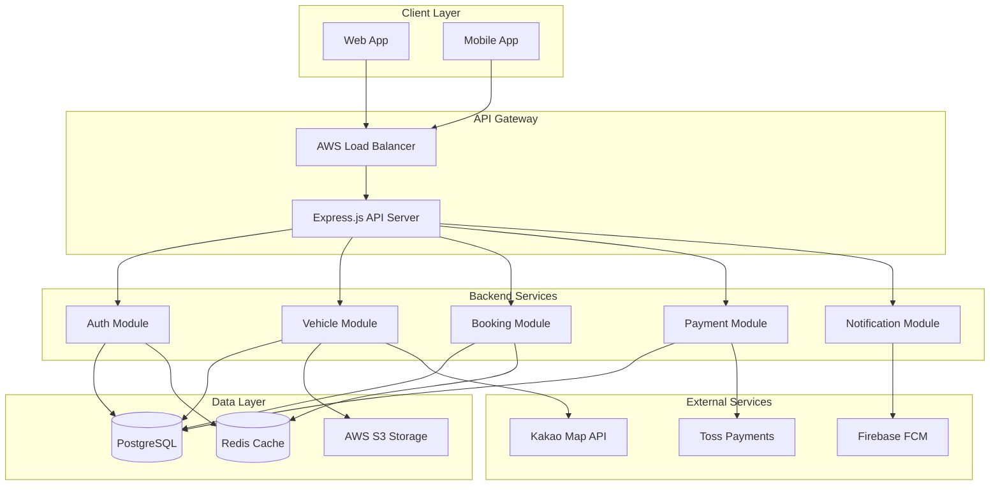
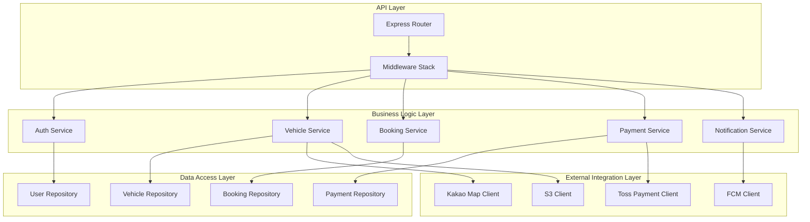
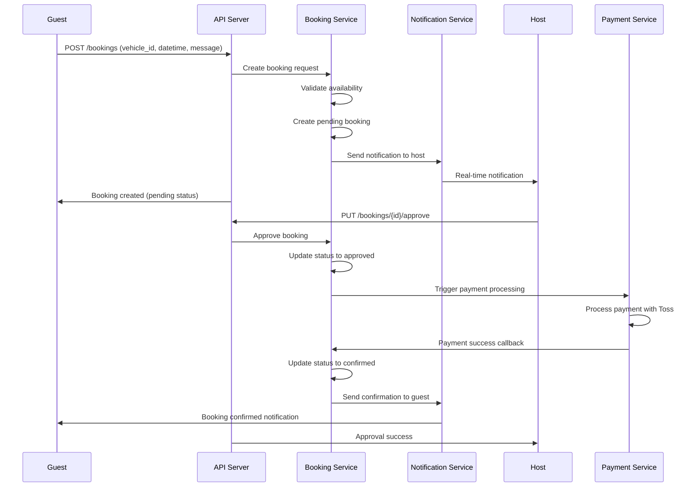
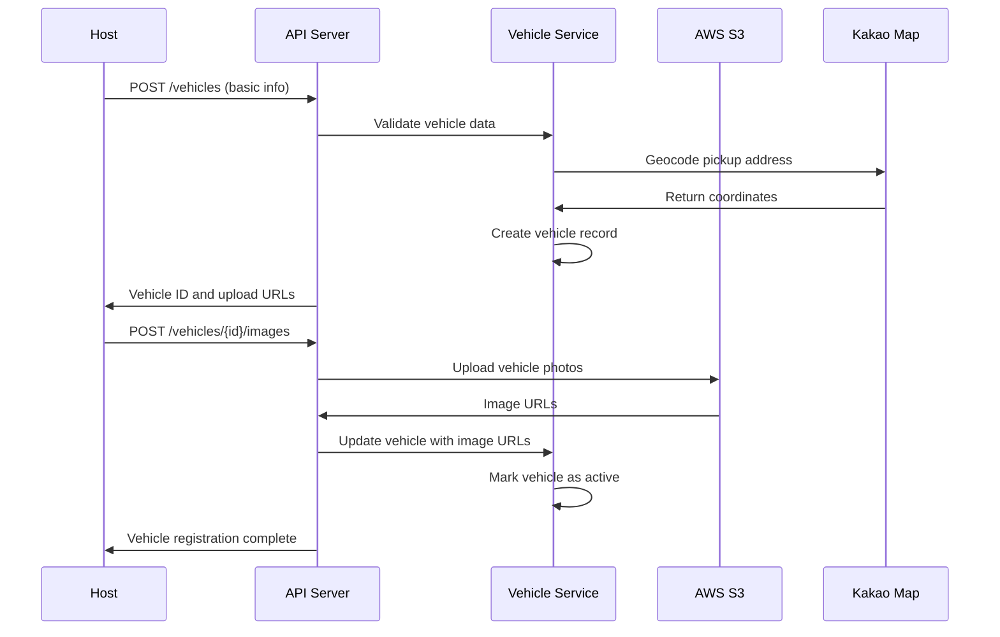

# 카셰어링 서비스 Backend Architecture Document

## Introduction

This document outlines the backend architecture for 카셰어링 서비스, a hybrid B2B/B2C car sharing platform. It serves as the definitive guide for AI-driven backend development, ensuring consistency and adherence to chosen patterns and technologies.

**Relationship to Frontend Architecture:**
This backend architecture must be used in conjunction with the Frontend Architecture Document. The technology stack choices documented herein are definitive for the entire project.

### Starter Template or Existing Project

**Decision**: Greenfield project with modern Node.js/TypeScript backend
- No existing backend codebase to inherit
- Clean architecture approach using proven patterns
- Modular monolith design for initial MVP with microservices readiness

### Change Log

| Date | Version | Description | Author |
|------|---------|-------------|---------|
| 2025-09-20 | v1.0 | Initial backend architecture creation | System Architect |

## High Level Architecture

### Technical Summary

The backend employs a modular monolith architecture deployed on AWS, utilizing Node.js with TypeScript for type safety and Express.js for HTTP handling. The system uses PostgreSQL as the primary database with Redis for caching and session management. The architecture supports real-time features through WebSocket connections and integrates seamlessly with Korean market services (Kakao Map, Toss Payments). JWT-based authentication provides secure access control for the hybrid B2B/B2C user model, while the modular design enables future microservices migration.

### High Level Overview

**Architectural Style**: Modular Monolith
- **Repository Structure**: Monorepo using npm workspaces
- **Service Architecture**: Single deployable application with clear module boundaries
- **User Interaction Flow**: REST API endpoints with real-time WebSocket updates
- **Key Decisions**:
  - Modular monolith provides faster initial development while maintaining microservices migration path
  - TypeScript throughout for type safety and better developer experience
  - Event-driven architecture within modules for loose coupling

### High Level Project Diagram



### Architectural and Design Patterns

- **Modular Monolith Pattern**: Clear module boundaries with potential for future microservices extraction - *Rationale*: Faster development and deployment while maintaining architectural flexibility
- **Repository Pattern**: Abstract data access logic behind interfaces - *Rationale*: Enables testing and future database migration flexibility
- **Event-Driven Communication**: Internal event bus for module communication - *Rationale*: Reduces coupling between modules and supports async processing
- **API Gateway Pattern**: Single entry point for all API requests - *Rationale*: Centralized authentication, rate limiting, and monitoring
- **CQRS Pattern**: Separate read and write operations for complex business logic - *Rationale*: Optimizes performance for booking queries vs commands

## Tech Stack

### Cloud Infrastructure

- **Provider**: AWS
- **Key Services**: EC2, RDS, ElastiCache, S3, CloudWatch, Application Load Balancer
- **Deployment Regions**: ap-northeast-2 (Seoul)

### Technology Stack Table

| Category | Technology | Version | Purpose | Rationale |
|----------|------------|---------|---------|-----------|
| **Language** | TypeScript | 5.3.3 | Primary development language | Strong typing, excellent tooling, team expertise |
| **Runtime** | Node.js | 20.11.0 | JavaScript runtime | LTS version, stable performance, wide ecosystem |
| **Framework** | Express.js | 4.18.2 | Web application framework | Mature, flexible, excellent middleware ecosystem |
| **Database** | PostgreSQL | 15.5 | Primary database | ACID compliance, JSON support, excellent performance |
| **Cache** | Redis | 7.2.3 | Caching and session store | Fast in-memory operations, pub/sub capabilities |
| **ORM** | Prisma | 5.7.1 | Database ORM | Type-safe queries, migrations, excellent TypeScript integration |
| **Authentication** | JWT | jsonwebtoken@9.0.2 | Stateless authentication | Scalable, secure, works well with SPAs |
| **Validation** | Joi | 17.11.0 | Input validation | Comprehensive validation rules, good TypeScript support |
| **Testing** | Jest | 29.7.0 | Unit and integration testing | Comprehensive testing framework, great TypeScript support |
| **WebSocket** | Socket.io | 4.7.4 | Real-time communication | Reliable real-time features, fallback support |
| **File Upload** | Multer | 1.4.5 | Multipart form handling | Standard Express.js file upload middleware |
| **Security** | Helmet | 7.1.0 | Security headers | Essential security middleware for Express |
| **Logging** | Winston | 3.11.0 | Structured logging | Comprehensive logging with multiple transports |
| **Process Manager** | PM2 | 5.3.0 | Production process management | Zero-downtime deployments, cluster mode |

## Data Models

### User

**Purpose**: Core user entity supporting both hosts (corporate users) and guests (individual users)

**Key Attributes**:
- id: UUID - Unique identifier
- email: string - Login credential and communication
- password_hash: string - Secure password storage
- name: string - Display name
- phone: string - Contact and verification
- role: enum - USER_TYPE (guest, host, admin)
- profile_image_url: string? - Optional profile picture
- is_verified: boolean - Email verification status
- created_at: timestamp - Account creation time
- updated_at: timestamp - Last modification time

**Relationships**:
- Has many: vehicles (if host), bookings (if guest), reviews_given, reviews_received
- Belongs to: corporate_profile (if host)

### CorporateProfile

**Purpose**: Additional profile information for corporate hosts (법인차 소유자)

**Key Attributes**:
- id: UUID - Unique identifier
- user_id: UUID - Reference to User
- company_name: string - Legal company name
- business_registration_number: string - 사업자등록번호
- tax_id: string - 세무 처리용 식별자
- is_verified: boolean - 법인 인증 상태
- verification_documents: JSON - Uploaded document references

**Relationships**:
- Belongs to: User
- Has many: Vehicles

### Vehicle

**Purpose**: Represents cars available for sharing on the platform

**Key Attributes**:
- id: UUID - Unique identifier
- owner_id: UUID - Reference to User (host)
- license_plate: string - 차량 번호판
- make: string - 제조사 (e.g., "Genesis")
- model: string - 모델명 (e.g., "G90")
- year: integer - 연식
- color: string - 차량 색상
- fuel_type: enum - FUEL_TYPE (gasoline, diesel, electric, hybrid)
- transmission: enum - TRANSMISSION (manual, automatic)
- hourly_rate: decimal - 시간당 대여료
- location_address: string - 픽업 위치 주소
- location_lat: decimal - GPS 위도
- location_lng: decimal - GPS 경도
- status: enum - VEHICLE_STATUS (active, inactive, maintenance)
- images: JSON array - S3 이미지 URL 배열
- description: text - 차량 설명
- created_at: timestamp
- updated_at: timestamp

**Relationships**:
- Belongs to: User (owner)
- Has many: Bookings, VehicleAvailabilities, Reviews

### VehicleAvailability

**Purpose**: Manages time slots when vehicles are available for booking

**Key Attributes**:
- id: UUID - Unique identifier
- vehicle_id: UUID - Reference to Vehicle
- day_of_week: integer - 요일 (0=Sunday, 6=Saturday)
- start_time: time - 시작 시간
- end_time: time - 종료 시간
- is_recurring: boolean - 반복 일정 여부
- specific_date: date? - 특정 날짜 (비반복 일정용)
- is_blocked: boolean - 차단된 시간대 여부

**Relationships**:
- Belongs to: Vehicle

### Booking

**Purpose**: Represents car rental reservations and their lifecycle

**Key Attributes**:
- id: UUID - Unique identifier
- vehicle_id: UUID - Reference to Vehicle
- guest_id: UUID - Reference to User (guest)
- host_id: UUID - Reference to User (host)
- start_datetime: timestamp - 대여 시작 시간
- end_datetime: timestamp - 대여 종료 시간
- total_amount: decimal - 총 결제 금액
- platform_fee: decimal - 플랫폼 수수료 (15%)
- status: enum - BOOKING_STATUS (pending, approved, rejected, active, completed, cancelled)
- guest_message: text? - 게스트 메시지
- host_response: text? - 호스트 응답
- pickup_photos: JSON array - 인수 시 사진
- return_photos: JSON array - 반납 시 사진
- created_at: timestamp
- updated_at: timestamp

**Relationships**:
- Belongs to: Vehicle, User (guest), User (host)
- Has one: Payment
- Has many: Reviews

### Payment

**Purpose**: Tracks payment transactions and settlements

**Key Attributes**:
- id: UUID - Unique identifier
- booking_id: UUID - Reference to Booking
- amount: decimal - 결제 금액
- platform_fee: decimal - 플랫폼 수수료
- host_amount: decimal - 호스트 수익 (85%)
- payment_method: string - 결제 수단
- toss_payment_key: string - 토스페이먼츠 거래 키
- status: enum - PAYMENT_STATUS (pending, completed, failed, refunded)
- paid_at: timestamp? - 결제 완료 시간
- settled_at: timestamp? - 정산 완료 시간

**Relationships**:
- Belongs to: Booking

### Review

**Purpose**: User feedback and rating system for trust building

**Key Attributes**:
- id: UUID - Unique identifier
- booking_id: UUID - Reference to Booking
- reviewer_id: UUID - Reference to User (reviewer)
- reviewee_id: UUID - Reference to User (reviewee)
- rating: integer - 평점 (1-5)
- category_ratings: JSON - 세부 평점 (청결도, 시간준수, 매너)
- comment: text? - 리뷰 내용
- is_recommended: boolean - 추천 여부
- created_at: timestamp

**Relationships**:
- Belongs to: Booking, User (reviewer), User (reviewee)

## Components

### Authentication Module

**Responsibility**: User authentication, authorization, and session management

**Key Interfaces**:
- POST /auth/register - User registration
- POST /auth/login - User authentication
- POST /auth/refresh - Token refresh
- POST /auth/logout - Session termination
- GET /auth/me - Current user profile

**Dependencies**: PostgreSQL (user data), Redis (session storage), JWT library

**Technology Stack**: Express.js routes, bcrypt for password hashing, JWT for tokens, Joi validation

### Vehicle Management Module

**Responsibility**: Vehicle registration, availability management, and search functionality

**Key Interfaces**:
- POST /vehicles - Register new vehicle
- GET /vehicles - Search available vehicles
- GET /vehicles/:id - Vehicle details
- PUT /vehicles/:id - Update vehicle information
- DELETE /vehicles/:id - Remove vehicle
- POST /vehicles/:id/availability - Manage availability schedules

**Dependencies**: PostgreSQL (vehicle data), S3 (image storage), Kakao Map API (location services)

**Technology Stack**: Express.js routes, Multer for file uploads, AWS SDK for S3

### Booking Management Module

**Responsibility**: Booking lifecycle, approval workflow, and real-time updates

**Key Interfaces**:
- POST /bookings - Create booking request
- GET /bookings - List user bookings
- PUT /bookings/:id/approve - Host approval
- PUT /bookings/:id/reject - Host rejection
- PUT /bookings/:id/cancel - Booking cancellation
- POST /bookings/:id/photos - Upload pickup/return photos

**Dependencies**: PostgreSQL (booking data), Redis (real-time state), WebSocket (notifications)

**Technology Stack**: Express.js routes, Socket.io for real-time updates, Multer for photo uploads

### Payment Processing Module

**Responsibility**: Payment processing, settlement, and financial reporting

**Key Interfaces**:
- POST /payments/process - Process payment
- GET /payments/history - Payment history
- POST /payments/settle - Trigger settlement
- GET /payments/settlements - Settlement reports
- POST /payments/webhook - Toss Payments webhook

**Dependencies**: Toss Payments API, PostgreSQL (payment data)

**Technology Stack**: Express.js routes, Toss Payments SDK, webhook verification

### Notification Module

**Responsibility**: Real-time notifications and communication

**Key Interfaces**:
- WebSocket connections for real-time updates
- POST /notifications/send - Send notification
- GET /notifications - User notification history
- PUT /notifications/:id/read - Mark as read

**Dependencies**: Firebase FCM (push notifications), Socket.io (real-time), Redis (pub/sub)

**Technology Stack**: Socket.io server, Firebase Admin SDK, Redis pub/sub

### Component Diagrams



## External APIs

### Kakao Map API

- **Purpose**: Location services, geocoding, and map display
- **Documentation**: https://developers.kakao.com/docs/latest/ko/local/dev-guide
- **Base URL(s)**: https://dapi.kakao.com
- **Authentication**: REST API Key in Authorization header
- **Rate Limits**: 100,000 requests/day (free tier)

**Key Endpoints Used**:
- `GET /v2/local/search/address.json` - Address to coordinates conversion
- `GET /v2/local/geo/coord2address.json` - Coordinates to address conversion

**Integration Notes**: Used for vehicle location validation and search radius calculations

### Toss Payments API

- **Purpose**: Payment processing and settlement for car sharing transactions
- **Documentation**: https://docs.tosspayments.com/reference
- **Base URL(s)**: https://api.tosspayments.com
- **Authentication**: Bearer token with secret key
- **Rate Limits**: No specific limits documented

**Key Endpoints Used**:
- `POST /v1/payments` - Process payment
- `GET /v1/payments/{paymentKey}` - Payment status inquiry
- `POST /v1/payments/{paymentKey}/cancel` - Cancel payment

**Integration Notes**: Webhook endpoint required for payment status updates, 15% platform fee handling

### Firebase Cloud Messaging API

- **Purpose**: Push notifications for booking updates and real-time alerts
- **Documentation**: https://firebase.google.com/docs/cloud-messaging
- **Base URL(s)**: https://fcm.googleapis.com
- **Authentication**: Service account key
- **Rate Limits**: 1,000,000 messages/month (free tier)

**Key Endpoints Used**:
- `POST /v1/projects/{project-id}/messages:send` - Send notification

**Integration Notes**: Supports both iOS and Android push notifications with custom data payloads

## Core Workflows

### Booking Creation and Approval Workflow



### Vehicle Registration Workflow



## REST API Spec

```yaml
openapi: 3.0.0
info:
  title: 카셰어링 서비스 API
  version: 1.0.0
  description: Car sharing platform API for corporate and individual users
servers:
  - url: https://api.carshare.co.kr/v1
    description: Production server
  - url: https://api-staging.carshare.co.kr/v1
    description: Staging server

paths:
  /auth/register:
    post:
      summary: User registration
      requestBody:
        required: true
        content:
          application/json:
            schema:
              type: object
              required: [email, password, name, phone, role]
              properties:
                email:
                  type: string
                  format: email
                password:
                  type: string
                  minLength: 8
                name:
                  type: string
                phone:
                  type: string
                role:
                  type: string
                  enum: [guest, host]
      responses:
        '201':
          description: User created successfully
          content:
            application/json:
              schema:
                $ref: '#/components/schemas/AuthResponse'

  /auth/login:
    post:
      summary: User authentication
      requestBody:
        required: true
        content:
          application/json:
            schema:
              type: object
              required: [email, password]
              properties:
                email:
                  type: string
                  format: email
                password:
                  type: string
      responses:
        '200':
          description: Login successful
          content:
            application/json:
              schema:
                $ref: '#/components/schemas/AuthResponse'

  /vehicles:
    get:
      summary: Search available vehicles
      parameters:
        - name: lat
          in: query
          required: true
          schema:
            type: number
        - name: lng
          in: query
          required: true
          schema:
            type: number
        - name: start_datetime
          in: query
          required: true
          schema:
            type: string
            format: date-time
        - name: end_datetime
          in: query
          required: true
          schema:
            type: string
            format: date-time
        - name: radius
          in: query
          schema:
            type: number
            default: 5
      responses:
        '200':
          description: Available vehicles
          content:
            application/json:
              schema:
                type: array
                items:
                  $ref: '#/components/schemas/Vehicle'

    post:
      summary: Register new vehicle
      security:
        - bearerAuth: []
      requestBody:
        required: true
        content:
          application/json:
            schema:
              $ref: '#/components/schemas/VehicleCreate'
      responses:
        '201':
          description: Vehicle created successfully
          content:
            application/json:
              schema:
                $ref: '#/components/schemas/Vehicle'

  /bookings:
    get:
      summary: Get user bookings
      security:
        - bearerAuth: []
      parameters:
        - name: status
          in: query
          schema:
            type: string
            enum: [pending, approved, active, completed, cancelled]
      responses:
        '200':
          description: User bookings
          content:
            application/json:
              schema:
                type: array
                items:
                  $ref: '#/components/schemas/Booking'

    post:
      summary: Create booking request
      security:
        - bearerAuth: []
      requestBody:
        required: true
        content:
          application/json:
            schema:
              $ref: '#/components/schemas/BookingCreate'
      responses:
        '201':
          description: Booking created successfully
          content:
            application/json:
              schema:
                $ref: '#/components/schemas/Booking'

components:
  securitySchemes:
    bearerAuth:
      type: http
      scheme: bearer
      bearerFormat: JWT

  schemas:
    AuthResponse:
      type: object
      properties:
        access_token:
          type: string
        refresh_token:
          type: string
        user:
          $ref: '#/components/schemas/User'

    User:
      type: object
      properties:
        id:
          type: string
          format: uuid
        email:
          type: string
          format: email
        name:
          type: string
        phone:
          type: string
        role:
          type: string
          enum: [guest, host, admin]
        profile_image_url:
          type: string
        is_verified:
          type: boolean
        created_at:
          type: string
          format: date-time

    Vehicle:
      type: object
      properties:
        id:
          type: string
          format: uuid
        license_plate:
          type: string
        make:
          type: string
        model:
          type: string
        year:
          type: integer
        hourly_rate:
          type: number
        location_address:
          type: string
        location_lat:
          type: number
        location_lng:
          type: number
        images:
          type: array
          items:
            type: string
        owner:
          $ref: '#/components/schemas/User'

    VehicleCreate:
      type: object
      required: [license_plate, make, model, year, hourly_rate, location_address]
      properties:
        license_plate:
          type: string
        make:
          type: string
        model:
          type: string
        year:
          type: integer
        color:
          type: string
        fuel_type:
          type: string
          enum: [gasoline, diesel, electric, hybrid]
        transmission:
          type: string
          enum: [manual, automatic]
        hourly_rate:
          type: number
        location_address:
          type: string
        description:
          type: string

    Booking:
      type: object
      properties:
        id:
          type: string
          format: uuid
        vehicle:
          $ref: '#/components/schemas/Vehicle'
        guest:
          $ref: '#/components/schemas/User'
        start_datetime:
          type: string
          format: date-time
        end_datetime:
          type: string
          format: date-time
        total_amount:
          type: number
        status:
          type: string
          enum: [pending, approved, rejected, active, completed, cancelled]
        guest_message:
          type: string
        created_at:
          type: string
          format: date-time

    BookingCreate:
      type: object
      required: [vehicle_id, start_datetime, end_datetime]
      properties:
        vehicle_id:
          type: string
          format: uuid
        start_datetime:
          type: string
          format: date-time
        end_datetime:
          type: string
          format: date-time
        guest_message:
          type: string
```

## Database Schema

```sql
-- User authentication and profiles
CREATE TABLE users (
    id UUID PRIMARY KEY DEFAULT gen_random_uuid(),
    email VARCHAR(255) UNIQUE NOT NULL,
    password_hash VARCHAR(255) NOT NULL,
    name VARCHAR(100) NOT NULL,
    phone VARCHAR(20) NOT NULL,
    role VARCHAR(20) NOT NULL CHECK (role IN ('guest', 'host', 'admin')),
    profile_image_url TEXT,
    is_verified BOOLEAN DEFAULT FALSE,
    created_at TIMESTAMP WITH TIME ZONE DEFAULT NOW(),
    updated_at TIMESTAMP WITH TIME ZONE DEFAULT NOW()
);

-- Corporate profile for hosts
CREATE TABLE corporate_profiles (
    id UUID PRIMARY KEY DEFAULT gen_random_uuid(),
    user_id UUID NOT NULL REFERENCES users(id) ON DELETE CASCADE,
    company_name VARCHAR(200) NOT NULL,
    business_registration_number VARCHAR(20) UNIQUE NOT NULL,
    tax_id VARCHAR(50),
    is_verified BOOLEAN DEFAULT FALSE,
    verification_documents JSONB,
    created_at TIMESTAMP WITH TIME ZONE DEFAULT NOW()
);

-- Vehicle information
CREATE TABLE vehicles (
    id UUID PRIMARY KEY DEFAULT gen_random_uuid(),
    owner_id UUID NOT NULL REFERENCES users(id) ON DELETE CASCADE,
    license_plate VARCHAR(20) UNIQUE NOT NULL,
    make VARCHAR(50) NOT NULL,
    model VARCHAR(50) NOT NULL,
    year INTEGER NOT NULL,
    color VARCHAR(30),
    fuel_type VARCHAR(20) CHECK (fuel_type IN ('gasoline', 'diesel', 'electric', 'hybrid')),
    transmission VARCHAR(20) CHECK (transmission IN ('manual', 'automatic')),
    hourly_rate DECIMAL(10,2) NOT NULL,
    location_address TEXT NOT NULL,
    location_lat DECIMAL(10,8) NOT NULL,
    location_lng DECIMAL(11,8) NOT NULL,
    status VARCHAR(20) DEFAULT 'active' CHECK (status IN ('active', 'inactive', 'maintenance')),
    images JSONB,
    description TEXT,
    created_at TIMESTAMP WITH TIME ZONE DEFAULT NOW(),
    updated_at TIMESTAMP WITH TIME ZONE DEFAULT NOW()
);

-- Vehicle availability schedules
CREATE TABLE vehicle_availabilities (
    id UUID PRIMARY KEY DEFAULT gen_random_uuid(),
    vehicle_id UUID NOT NULL REFERENCES vehicles(id) ON DELETE CASCADE,
    day_of_week INTEGER CHECK (day_of_week >= 0 AND day_of_week <= 6),
    start_time TIME,
    end_time TIME,
    is_recurring BOOLEAN DEFAULT TRUE,
    specific_date DATE,
    is_blocked BOOLEAN DEFAULT FALSE,
    created_at TIMESTAMP WITH TIME ZONE DEFAULT NOW(),

    CONSTRAINT check_recurring_or_specific CHECK (
        (is_recurring = TRUE AND day_of_week IS NOT NULL AND specific_date IS NULL) OR
        (is_recurring = FALSE AND specific_date IS NOT NULL AND day_of_week IS NULL)
    )
);

-- Booking reservations
CREATE TABLE bookings (
    id UUID PRIMARY KEY DEFAULT gen_random_uuid(),
    vehicle_id UUID NOT NULL REFERENCES vehicles(id),
    guest_id UUID NOT NULL REFERENCES users(id),
    host_id UUID NOT NULL REFERENCES users(id),
    start_datetime TIMESTAMP WITH TIME ZONE NOT NULL,
    end_datetime TIMESTAMP WITH TIME ZONE NOT NULL,
    total_amount DECIMAL(10,2) NOT NULL,
    platform_fee DECIMAL(10,2) NOT NULL,
    status VARCHAR(20) DEFAULT 'pending' CHECK (status IN ('pending', 'approved', 'rejected', 'active', 'completed', 'cancelled')),
    guest_message TEXT,
    host_response TEXT,
    pickup_photos JSONB,
    return_photos JSONB,
    created_at TIMESTAMP WITH TIME ZONE DEFAULT NOW(),
    updated_at TIMESTAMP WITH TIME ZONE DEFAULT NOW()
);

-- Payment transactions
CREATE TABLE payments (
    id UUID PRIMARY KEY DEFAULT gen_random_uuid(),
    booking_id UUID NOT NULL REFERENCES bookings(id),
    amount DECIMAL(10,2) NOT NULL,
    platform_fee DECIMAL(10,2) NOT NULL,
    host_amount DECIMAL(10,2) NOT NULL,
    payment_method VARCHAR(50),
    toss_payment_key VARCHAR(100),
    status VARCHAR(20) DEFAULT 'pending' CHECK (status IN ('pending', 'completed', 'failed', 'refunded')),
    paid_at TIMESTAMP WITH TIME ZONE,
    settled_at TIMESTAMP WITH TIME ZONE,
    created_at TIMESTAMP WITH TIME ZONE DEFAULT NOW()
);

-- Reviews and ratings
CREATE TABLE reviews (
    id UUID PRIMARY KEY DEFAULT gen_random_uuid(),
    booking_id UUID NOT NULL REFERENCES bookings(id),
    reviewer_id UUID NOT NULL REFERENCES users(id),
    reviewee_id UUID NOT NULL REFERENCES users(id),
    rating INTEGER NOT NULL CHECK (rating >= 1 AND rating <= 5),
    category_ratings JSONB,
    comment TEXT,
    is_recommended BOOLEAN DEFAULT TRUE,
    created_at TIMESTAMP WITH TIME ZONE DEFAULT NOW(),

    UNIQUE(booking_id, reviewer_id)
);

-- Indexes for performance
CREATE INDEX idx_vehicles_location ON vehicles(location_lat, location_lng);
CREATE INDEX idx_vehicles_status ON vehicles(status) WHERE status = 'active';
CREATE INDEX idx_bookings_datetime ON bookings(start_datetime, end_datetime);
CREATE INDEX idx_bookings_status ON bookings(status);
CREATE INDEX idx_users_email ON users(email);
CREATE INDEX idx_reviews_rating ON reviews(rating);

-- Full-text search for vehicles
CREATE INDEX idx_vehicles_search ON vehicles USING GIN(to_tsvector('korean', make || ' ' || model || ' ' || COALESCE(description, '')));
```

## Source Tree

```
backend/
├── src/
│   ├── modules/                    # Business modules
│   │   ├── auth/
│   │   │   ├── auth.controller.ts
│   │   │   ├── auth.service.ts
│   │   │   ├── auth.middleware.ts
│   │   │   ├── jwt.strategy.ts
│   │   │   └── auth.types.ts
│   │   ├── users/
│   │   │   ├── users.controller.ts
│   │   │   ├── users.service.ts
│   │   │   ├── users.repository.ts
│   │   │   └── users.types.ts
│   │   ├── vehicles/
│   │   │   ├── vehicles.controller.ts
│   │   │   ├── vehicles.service.ts
│   │   │   ├── vehicles.repository.ts
│   │   │   ├── vehicle-search.service.ts
│   │   │   └── vehicles.types.ts
│   │   ├── bookings/
│   │   │   ├── bookings.controller.ts
│   │   │   ├── bookings.service.ts
│   │   │   ├── bookings.repository.ts
│   │   │   ├── booking-workflow.service.ts
│   │   │   └── bookings.types.ts
│   │   ├── payments/
│   │   │   ├── payments.controller.ts
│   │   │   ├── payments.service.ts
│   │   │   ├── payments.repository.ts
│   │   │   ├── toss-payment.client.ts
│   │   │   └── payments.types.ts
│   │   └── notifications/
│   │       ├── notifications.controller.ts
│   │       ├── notifications.service.ts
│   │       ├── websocket.gateway.ts
│   │       ├── fcm.client.ts
│   │       └── notifications.types.ts
│   ├── shared/                     # Shared utilities
│   │   ├── database/
│   │   │   ├── prisma.service.ts
│   │   │   ├── schema.prisma
│   │   │   └── migrations/
│   │   ├── external/               # External API clients
│   │   │   ├── kakao-map.client.ts
│   │   │   ├── s3.client.ts
│   │   │   └── base.client.ts
│   │   ├── middleware/
│   │   │   ├── cors.middleware.ts
│   │   │   ├── rate-limit.middleware.ts
│   │   │   ├── validation.middleware.ts
│   │   │   └── error.middleware.ts
│   │   ├── utils/
│   │   │   ├── logger.ts
│   │   │   ├── config.ts
│   │   │   ├── crypto.ts
│   │   │   └── validation.ts
│   │   └── types/
│   │       ├── common.types.ts
│   │       ├── api.types.ts
│   │       └── database.types.ts
│   ├── app.ts                      # Express app setup
│   ├── server.ts                   # Server startup
│   └── routes.ts                   # Route definitions
├── tests/                          # Test files
│   ├── unit/
│   ├── integration/
│   └── fixtures/
├── prisma/                         # Database schema and migrations
│   ├── schema.prisma
│   ├── migrations/
│   └── seed.ts
├── docs/                           # API documentation
│   ├── openapi.yaml
│   └── postman/
├── scripts/                        # Utility scripts
│   ├── setup.sh
│   ├── deploy.sh
│   └── migrate.sh
├── Dockerfile
├── package.json
├── tsconfig.json
├── jest.config.js
├── .env.example
└── README.md
```

## Infrastructure and Deployment

### Infrastructure as Code

- **Tool**: AWS CDK 2.100.0
- **Location**: `infrastructure/`
- **Approach**: TypeScript-based infrastructure definitions with staging and production stacks

### Deployment Strategy

- **Strategy**: Blue-Green deployment with health checks
- **CI/CD Platform**: GitHub Actions
- **Pipeline Configuration**: `.github/workflows/deploy.yml`

### Environments

- **Development**: Local Docker environment - `http://localhost:3000`
- **Staging**: AWS ECS Fargate cluster - Pre-production testing and UAT
- **Production**: AWS ECS Fargate cluster - Live environment with auto-scaling

### Environment Promotion Flow

```
feature/branch → Development → Staging → Production
                     ↓            ↓          ↓
                 Unit Tests → Integration → E2E Tests
                              Tests
```

### Rollback Strategy

- **Primary Method**: AWS ECS service rollback to previous task definition
- **Trigger Conditions**: Health check failures, error rate > 5%, response time > 2s
- **Recovery Time Objective**: < 5 minutes

## Error Handling Strategy

### General Approach

- **Error Model**: Structured error responses with codes and context
- **Exception Hierarchy**: Custom error classes extending base Error
- **Error Propagation**: Centralized error handling middleware

### Logging Standards

- **Library**: Winston 3.11.0
- **Format**: JSON structured logs with correlation IDs
- **Levels**: error, warn, info, debug
- **Required Context**:
  - Correlation ID: UUID v4 format for request tracing
  - Service Context: Module name and function
  - User Context: User ID (if authenticated), IP address

### Error Handling Patterns

#### External API Errors

- **Retry Policy**: Exponential backoff with max 3 retries
- **Circuit Breaker**: Open after 5 consecutive failures, half-open after 30s
- **Timeout Configuration**: 10s for Kakao Map, 30s for Toss Payments
- **Error Translation**: Map external error codes to internal error types

#### Business Logic Errors

- **Custom Exceptions**: BookingConflictError, PaymentFailedError, VehicleUnavailableError
- **User-Facing Errors**: Localized Korean error messages
- **Error Codes**: Hierarchical code system (AUTH001, BOOKING002, etc.)

#### Data Consistency

- **Transaction Strategy**: Database transactions for multi-table operations
- **Compensation Logic**: Saga pattern for distributed operations
- **Idempotency**: UUID-based operation keys to prevent duplicate processing

## Coding Standards

### Core Standards

- **Languages & Runtimes**: TypeScript 5.3.3, Node.js 20.11.0 (strict mode)
- **Style & Linting**: ESLint with @typescript-eslint, Prettier for formatting
- **Test Organization**: Tests co-located with source files, .test.ts suffix

### Naming Conventions

| Element | Convention | Example |
|---------|------------|---------|
| Files | kebab-case | `user-service.ts` |
| Classes | PascalCase | `BookingService` |
| Functions | camelCase | `createBooking` |
| Constants | UPPER_SNAKE_CASE | `MAX_RETRY_ATTEMPTS` |
| Database Tables | snake_case | `vehicle_availabilities` |

### Critical Rules

- **No Direct Database Access**: Always use repository pattern, never direct Prisma queries in controllers
- **Environment Variables**: Access via Config service only, never process.env directly
- **API Responses**: Must use ApiResponse wrapper type for consistency
- **Authentication**: All protected routes must use JWT middleware
- **Validation**: All request inputs must be validated using Joi schemas
- **Logging**: Use structured logging with correlation IDs, never console.log
- **Error Handling**: Throw typed errors, never generic Error objects

## Test Strategy and Standards

### Testing Philosophy

- **Approach**: Test-driven development for critical business logic
- **Coverage Goals**: 80% overall coverage, 90% for business logic modules
- **Test Pyramid**: 70% unit tests, 20% integration tests, 10% E2E tests

### Test Types and Organization

#### Unit Tests

- **Framework**: Jest 29.7.0
- **File Convention**: `*.test.ts` alongside source files
- **Location**: `src/modules/*/tests/`
- **Mocking Library**: Jest built-in mocking
- **Coverage Requirement**: 80% line coverage

**AI Agent Requirements**:
- Generate tests for all public methods
- Cover edge cases and error conditions
- Follow AAA pattern (Arrange, Act, Assert)
- Mock all external dependencies

#### Integration Tests

- **Scope**: Module integration with database and external services
- **Location**: `tests/integration/`
- **Test Infrastructure**:
  - **Database**: Docker PostgreSQL container for isolation
  - **Cache**: Docker Redis container
  - **External APIs**: WireMock for API stubbing

#### End-to-End Tests

- **Framework**: Supertest for API testing
- **Scope**: Complete user workflows (registration → booking → payment)
- **Environment**: Dedicated test environment with test data
- **Test Data**: Factory functions with realistic test data

### Test Data Management

- **Strategy**: Factory pattern with random data generation
- **Fixtures**: `tests/fixtures/` directory with reusable test data
- **Factories**: Faker.js for generating realistic test data
- **Cleanup**: Database cleanup after each test suite

### Continuous Testing

- **CI Integration**: All tests run on every PR and merge
- **Performance Tests**: Load testing with Artillery.js
- **Security Tests**: OWASP ZAP security scanning in CI

## Security

### Input Validation

- **Validation Library**: Joi 17.11.0
- **Validation Location**: Request middleware before controller processing
- **Required Rules**:
  - All external inputs MUST be validated
  - Validation at API boundary before processing
  - Whitelist approach preferred over blacklist

### Authentication & Authorization

- **Auth Method**: JWT tokens with refresh token rotation
- **Session Management**: Stateless JWT with Redis blacklist for logout
- **Required Patterns**:
  - All protected routes use JWT middleware
  - Role-based access control for admin functions
  - Rate limiting per user for sensitive operations

### Secrets Management

- **Development**: Environment variables in .env file (gitignored)
- **Production**: AWS Systems Manager Parameter Store
- **Code Requirements**:
  - NEVER hardcode secrets
  - Access via configuration service only
  - No secrets in logs or error messages

### API Security

- **Rate Limiting**: 100 requests/minute per IP, 1000/hour per user
- **CORS Policy**: Specific origins allowed, credentials included
- **Security Headers**: Helmet.js with HSTS, CSP, X-Frame-Options
- **HTTPS Enforcement**: Force HTTPS in production, HTTP redirect

### Data Protection

- **Encryption at Rest**: AWS RDS encryption enabled
- **Encryption in Transit**: TLS 1.3 for all API communications
- **PII Handling**: Password hashing with bcrypt, phone number masking in logs
- **Logging Restrictions**: Never log passwords, payment details, or full personal info

### Dependency Security

- **Scanning Tool**: npm audit and Snyk
- **Update Policy**: Monthly dependency updates, critical security patches immediately
- **Approval Process**: Security review for new dependencies with network access

### Security Testing

- **SAST Tool**: SonarCloud static analysis
- **DAST Tool**: OWASP ZAP dynamic analysis
- **Penetration Testing**: Quarterly external security audit

## Next Steps

### Development Readiness

This backend architecture provides:
✅ **Complete API specification** with OpenAPI documentation
✅ **Database schema** ready for migration generation
✅ **Module structure** for immediate development start
✅ **Security framework** with Korean regulatory compliance
✅ **Integration patterns** for Kakao and Toss services

### Required Actions

1. **Frontend Architecture**: Create complementary frontend architecture document
2. **Infrastructure Setup**: Provision AWS resources using CDK
3. **Development Environment**: Set up local Docker development stack
4. **CI/CD Pipeline**: Configure GitHub Actions for automated deployment

### Development Team Handoff

**Backend Developer Instructions**:
- Use this document as the definitive guide for all backend development
- Follow the coding standards strictly for AI compatibility
- Implement modules in dependency order: Auth → Users → Vehicles → Bookings → Payments
- Ensure all external API integrations are properly tested with mocks

**DevOps Team Instructions**:
- Set up AWS infrastructure using the CDK definitions
- Configure monitoring with CloudWatch and alerting
- Implement blue-green deployment pipeline
- Set up database backup and disaster recovery procedures