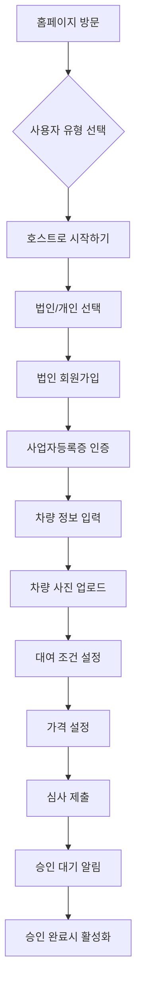
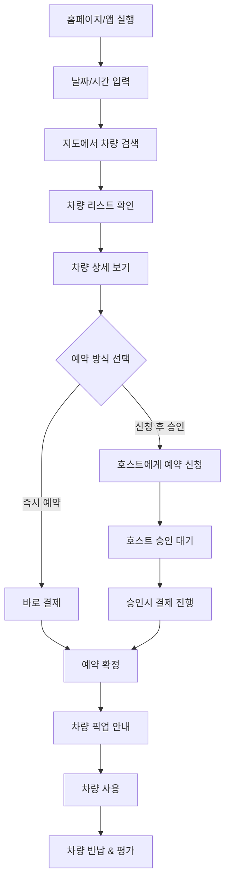
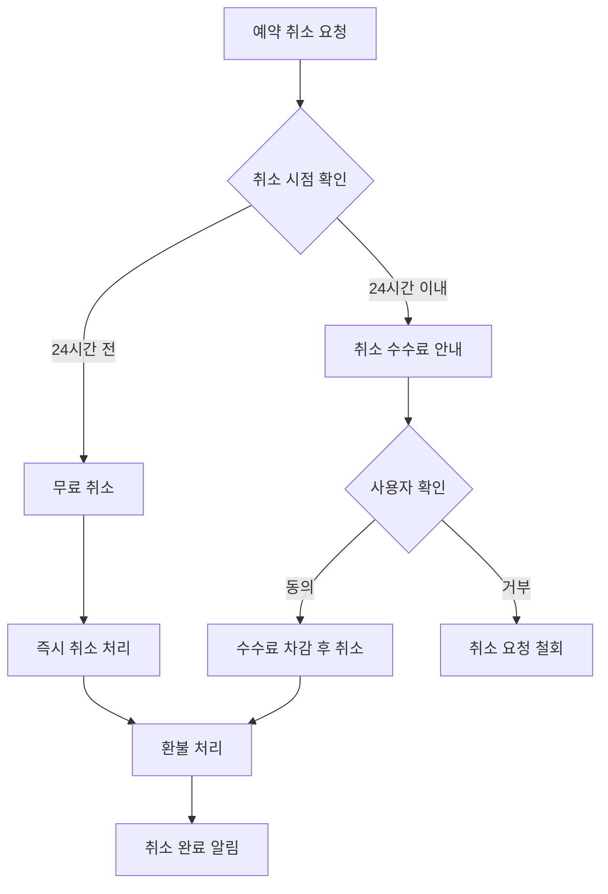

# 카셰어링 서비스 UI/UX Specification

*작성 중 - Interactive Mode*

## Introduction

This document defines the user experience goals, information architecture, user flows, and visual design specifications for 카셰어링 서비스's user interface. It serves as the foundation for visual design and frontend development, ensuring a cohesive and user-centered experience.

### Overall UX Goals & Principles

#### Primary UX Goals

**1. Trust & Safety First**
- 차량 소유자와 대여자 간 신뢰 구축이 핵심
- 투명한 정보 제공 (차량 상태, 사용자 평점, 거래 내역)
- 명확한 책임 소재와 보험 정보 표시

**2. Simplicity Over Features**
- 복잡한 기능보다 직관적이고 간단한 사용 경험 우선
- 최소 클릭으로 핵심 작업 완료 (차량 등록, 예약 신청, 승인)
- 불필요한 단계 제거

**3. Mobile-First Efficiency**
- 80% 이상 모바일 사용을 고려한 터치 친화적 인터페이스
- 빠른 로딩 속도 (3초 이내 페이지 로드)
- 오프라인 기본 기능 지원

#### Design Principles

**Transparency (투명성)**
- 모든 비용, 조건, 정책을 사전에 명확히 표시
- 숨겨진 수수료 없는 정직한 가격 정책
- 실시간 상태 업데이트

**Accessibility (접근성)**
- WCAG 2.1 AA 준수
- 다양한 연령대 (25-65세) 사용자 고려
- 색상, 폰트 크기, 터치 영역 최적화

**Responsiveness (반응성)**
- 실시간 알림과 상태 피드백
- 사용자 액션에 대한 즉각적 반응
- 로딩 상태 명확한 표시

**Consistency (일관성)**
- 플랫폼 전반에서 통일된 디자인 언어
- 예측 가능한 인터랙션 패턴
- 표준 웹/모바일 UX 패턴 준수

---

## Target Users & Scenarios

### Primary User Personas

#### 🏢 Persona 1: 법인차 호스트 (김대표, 39세)

**Profile**
- 스타트업 대표, 직원 15명 규모
- 절세 목적으로 구매한 법인차 소유 (G90, 2022년식)
- 주 2-3일만 사용, 나머지는 사무실 주차장에 방치
- 월 유지비 250만원 부담, 추가 수익원 모색

**Goals & Motivations**
- 놀고 있는 차량으로 월 50-80만원 수익 창출
- 간편한 세무 처리 (법인 소득 신고 자동화)
- 차량 손상 위험 최소화

**Pain Points**
- 기존 개인 카셰어링 서비스는 법인 특화 기능 부족
- 세무 처리의 복잡함
- 대여자 신뢰도에 대한 불안감

**Technology Comfort**
- 중급 (업무용 앱 사용 가능하지만 복잡한 기능은 선호하지 않음)
- 주로 모바일 사용, 간헐적 데스크톱 업무

#### 👤 Persona 2: 개인 게스트 (이지수, 28세)

**Profile**
- IT 회사 직장인, 무차량자
- 월소득 450만원, 강남 원룸 거주
- 주말 나들이, 쇼핑몰, 데이트 목적으로 차량 필요

**Goals & Motivations**
- 필요할 때만 합리적 가격에 차량 이용
- 차량 소유 부담 없이 자유로운 이동
- 쏘카/그린카 대비 10-20% 저렴한 비용

**Pain Points**
- 기존 카셰어링 높은 비용 (시간당 1만원 이상)
- 복잡한 반납 프로세스 (사진 촬영 등)
- 원하는 시간대/위치 차량 부족

**Technology Comfort**
- 고급 (모든 모바일 앱 능숙 사용)
- 모바일 퍼스트, 빠른 예약/결제 선호

### User Scenarios

#### Scenario 1: 법인차 등록 (김대표)

**Context**: 월요일 오전, 사무실에서 차량 등록을 시도

**Steps**:
1. 카셰어링 앱 다운로드 후 법인 회원가입
2. 차량 정보 입력 (번호판, 차종, 연식)
3. 법인 서류 인증 (사업자등록증 사진 업로드)
4. 차량 사진 촬영 (외관 4방향, 내부 2장)
5. 대여 가능 시간대 설정 (화/수/목 9-18시 제외)
6. 시간당 가격 설정 (15,000원 제안 수락)
7. 심사 대기 (1-2일)

**Success Criteria**: 10분 이내 등록 완료, 직관적인 법인 인증 프로세스

#### Scenario 2: 차량 예약 (이지수)

**Context**: 금요일 저녁, 주말 나들이 계획하며 차량 검색

**Steps**:
1. 앱 실행 → 날짜/시간 선택 (토요일 10시-18시)
2. 지도에서 픽업 가능한 차량 확인
3. 차량 상세 정보 확인 (사진, 평점, 가격)
4. 즉시 예약 신청 또는 호스트에게 메시지
5. 호스트 승인 대기 (30분 이내)
6. 결제 (토스페이 연동)
7. 차량 위치 안내 및 픽업 방법 확인

**Success Criteria**: 3분 이내 예약 신청 완료, 30분 이내 승인/거절 알림

#### Scenario 3: 차량 인수/반납 (이지수)

**Context**: 토요일 오전, 약속된 장소에서 차량 픽업

**Steps**:
1. 호스트와 약속된 장소/시간에 만남
2. 앱에서 "차량 인수" 체크인
3. 차량 상태 확인 및 사진 촬영 (AI 가이드)
4. 간단한 인수증 디지털 서명
5. **사용 중**: GPS 추적, 긴급 연락처 제공
6. **반납 시**: 동일 장소에서 차량 상태 재촬영
7. 호스트 확인 후 거래 완료, 상호 평가

**Success Criteria**: 인수/반납 각 5분 이내, 분쟁 방지를 위한 명확한 증거 보관

---

## Information Architecture

### Site Map & Navigation Structure

```
카셰어링 서비스 (Hybrid B2B/B2C Platform)
├── 🏠 홈페이지
│   ├── 헤로 섹션 (호스트/게스트 구분 진입)
│   ├── 서비스 소개
│   ├── 신뢰 & 안전 보장
│   └── 시작하기 CTA
│
├── 🔍 차량 검색 (게스트)
│   ├── 지도 기반 검색
│   ├── 날짜/시간 필터
│   ├── 차종/가격 필터
│   └── 검색 결과 리스트
│
├── 🚗 차량 상세
│   ├── 차량 정보 & 사진 갤러리
│   ├── 호스트 프로필 & 평점
│   ├── 가격 정보 & 수수료
│   ├── 예약 가능 시간
│   └── 즉시 예약/문의 버튼
│
├── 📝 예약 관리
│   ├── 예약 신청 내역
│   ├── 승인/거절 현황
│   ├── 진행 중인 대여
│   └── 완료된 거래 이력
│
├── 🏢 호스트 대시보드
│   ├── 차량 등록 관리
│   ├── 예약 요청 승인/거절
│   ├── 수익 현황 & 정산
│   ├── 법인 세무 리포트
│   └── 차량 스케줄 관리
│
├── 👤 마이페이지
│   ├── 프로필 관리
│   ├── 평점 & 리뷰
│   ├── 결제 수단 관리
│   ├── 알림 설정
│   └── 고객 지원
│
└── 📞 고객 지원
    ├── FAQ
    ├── 1:1 문의
    ├── 긴급 연락처
    └── 이용 가이드
```

### Content Hierarchy

#### Level 1: Primary Actions
- **게스트**: 차량 검색 → 예약 → 결제
- **호스트**: 차량 등록 → 예약 승인 → 수익 확인

#### Level 2: Management Functions
- 예약 관리, 프로필 설정, 평점 관리

#### Level 3: Support & Settings
- 고객 지원, 설정, 정책 및 약관

---

## User Flows

### Critical User Journey 1: 신규 호스트 차량 등록



### Critical User Journey 2: 게스트 차량 예약



### Error Recovery Flow: 예약 취소



---

## Wireframes & Component Specifications

### Key Screen Layout Specifications

#### 1. 홈페이지 (Landing Page)

**Layout Structure**
```
[헤더: 로고 | 로그인/회원가입]
[히어로 섹션]
  - 대형 제목: "놀고 있는 차, 이제 수익으로 만들어보세요"
  - 서브 제목: "법인차 특화 P2P 카셰어링"
  - 듀얼 CTA: [호스트 시작하기] [게스트 찾기]
[서비스 특징 3개 섹션]
  - 법인 특화 | 안전 보장 | 합리적 가격
[신뢰 지표]
  - 등록 차량 수 | 누적 거래액 | 사용자 만족도
[푸터: 약관/정책 링크]
```

**반응형 브레이크포인트**
- Mobile: 320-768px (Single column)
- Tablet: 768-1024px (Two column)
- Desktop: 1024px+ (Multi column)

#### 2. 차량 검색 페이지 (게스트용)

**Layout Structure**
```
[상단 검색 바]
  - 날짜/시간 피커 | 위치 설정 | 차종 필터
[지도 뷰 / 리스트 뷰 토글]
[지도 영역 (50% 화면)]
  - 차량 위치 마커 (가격 표시)
  - 확대/축소, 지역 이동
[차량 리스트 (50% 화면)]
  - 카드 형태: 사진 | 차종/연식 | 가격/시간 | 평점 | [예약] 버튼
[하단 필터 패널]
  - 가격 범위 | 차종 | 즉시 예약 가능 | 호스트 평점
```

**모바일 적응**
- 지도/리스트 전환 탭
- 하단에서 위로 스와이프하여 상세 필터
- 무한 스크롤 차량 목록

#### 3. 차량 상세 페이지

**Layout Structure**
```
[차량 이미지 갤러리]
  - 메인 이미지 + 썸네일 4-6개
  - 좌우 스와이프 네비게이션
[차량 기본 정보]
  - 차종/연식 | 연료 | 주행거리 | 변속기
[호스트 정보 카드]
  - 프로필 사진 | 이름 | 가입일 | 평점 (별점/5.0)
  - 응답 시간 | 승인률
[가격 정보]
  - 시간당 요금 (대형 표시)
  - 플랫폼 수수료 | 보험료 | 총 예상 비용
[예약 위젯]
  - 날짜/시간 선택기
  - [즉시 예약] [예약 문의] 버튼
[리뷰 섹션]
  - 평점 요약 | 최근 리뷰 3개 | [전체 보기]
```

#### 4. 호스트 대시보드

**Layout Structure**
```
[상단 요약 카드]
  - 이번 달 수익 | 예약 건수 | 차량 가동률 | 평점
[빠른 액션 버튼]
  - [새 차량 등록] [스케줄 관리] [수익 정산]
[예약 요청 알림]
  - 대기 중인 예약 신청 (실시간)
  - 승인/거절 원터치 버튼
[차량 관리 섹션]
  - 등록된 차량 목록
  - 각 차량별: 사진 | 상태 | 다음 예약 | [관리]
[달력 뷰]
  - 월간 예약 현황
  - 수익 예측 정보
```

### Component Library Specifications

#### Navigation Components

**1. Primary Navigation**
```typescript
interface PrimaryNav {
  logo: string;
  menuItems: NavItem[];
  userActions: 'login' | 'profile';
  mobileMenu: boolean;
}

NavItem {
  label: string;
  href: string;
  icon?: IconType;
  badge?: number; // 알림 개수
}
```

**2. Breadcrumb Navigation**
- 최대 3단계 깊이
- 현재 페이지는 링크 비활성화
- 모바일에서는 "< 이전" 버튼으로 단순화

#### Form Components

**3. Search Filter Panel**
```typescript
interface SearchFilters {
  dateRange: DateRange;
  location: GeoLocation;
  priceRange: [number, number];
  carType: CarType[];
  instantBook: boolean;
  hostRating: number;
}
```

**4. Vehicle Registration Form**
- 단계별 마법사 형태 (7단계)
- 진행률 표시기
- 이전/다음 버튼
- 실시간 유효성 검사
- 자동 저장 기능

#### Card Components

**5. Vehicle Card (리스트용)**
```typescript
interface VehicleCard {
  id: string;
  images: string[];
  title: string; // "2022 제네시스 G90"
  location: string;
  pricePerHour: number;
  rating: number;
  reviewCount: number;
  instantBook: boolean;
  hostInfo: HostSummary;
}
```

**6. Booking Request Card (호스트용)**
```typescript
interface BookingRequestCard {
  requestId: string;
  guestInfo: GuestProfile;
  vehicle: VehicleSummary;
  dateTime: BookingPeriod;
  totalAmount: number;
  message?: string;
  actions: ['approve', 'decline', 'counter'];
}
```

#### Interactive Components

**7. Map Component**
- 카카오맵 기반
- 차량 위치 커스텀 마커
- 클러스터링 (10개 이상 시)
- 현재 위치 버튼
- 확대/축소 레벨 제한

**8. Image Gallery**
- 메인 이미지 + 썸네일
- 터치/스와이프 지원
- 풀스크린 모드
- 이미지 로딩 상태 표시

**9. Calendar/DateTime Picker**
- 한국어 로케일
- 과거 날짜 비활성화
- 예약 불가능한 시간 음영 처리
- 시간 단위: 1시간 간격

#### Feedback Components

**10. Rating & Review Component**
```typescript
interface RatingReview {
  rating: number; // 1-5
  categories: RatingCategory[]; // 청결도, 친절함, 시간 준수
  reviewText: string;
  photos?: string[];
  date: Date;
  helpful: number; // 도움됨 개수
}
```

**11. Status Indicator**
- 예약 상태: 대기중 | 승인됨 | 거절됨 | 진행중 | 완료
- 차량 상태: 활성 | 비활성 | 점검중
- 색상 코딩: 성공(녹색) | 대기(노랑) | 오류(빨강)

#### Notification Components

**12. Toast Notifications**
- 우상단 고정 위치
- 4초 자동 소멸
- 액션 버튼 포함 가능
- 타입별 아이콘 (성공, 경고, 오류, 정보)

**13. Push Notification**
- 예약 신청/승인 실시간 알림
- 인앱 알림 배지
- 사운드 및 진동 설정 가능

---

## Visual Design System

### Color Palette

#### Primary Colors
```scss
$primary-blue: #2E5BFF;     // 메인 브랜드 컬러
$primary-dark: #1A47CC;     // 호버/액티브 상태
$primary-light: #E8F0FF;    // 배경/테두리

$secondary-green: #00C851;   // 성공/승인 상태
$secondary-orange: #FF9500;  // 경고/대기 상태
$secondary-red: #FF4444;     // 오류/거절 상태
```

#### Neutral Colors
```scss
$gray-900: #1A1A1A;        // 메인 텍스트
$gray-700: #4A4A4A;        // 서브 텍스트
$gray-500: #9E9E9E;        // 플레이스홀더
$gray-300: #E0E0E0;        // 테두리
$gray-100: #F5F5F5;        // 배경
$white: #FFFFFF;           // 카드/모달 배경
```

### Typography

#### Font Family
```scss
$font-family-primary: 'Pretendard', -apple-system, BlinkMacSystemFont, sans-serif;
$font-family-numeric: 'SF Pro Display', 'Pretendard', sans-serif; // 숫자 표시용
```

#### Font Scale
```scss
$font-size-h1: 32px;       // 페이지 제목
$font-size-h2: 24px;       // 섹션 제목
$font-size-h3: 20px;       // 서브섹션
$font-size-body: 16px;     // 본문
$font-size-small: 14px;    // 캡션/라벨
$font-size-xs: 12px;       // 부가 정보

$line-height-tight: 1.2;   // 제목용
$line-height-normal: 1.5;  // 본문용
$line-height-loose: 1.8;   // 긴 텍스트용
```

### Spacing System

#### Base Unit: 4px
```scss
$space-1: 4px;             // 매우 작은 간격
$space-2: 8px;             // 작은 간격
$space-3: 12px;            // 기본 간격
$space-4: 16px;            // 중간 간격
$space-6: 24px;            // 큰 간격
$space-8: 32px;            // 매우 큰 간격
$space-12: 48px;           // 섹션 간격
$space-16: 64px;           // 페이지 간격
```

### Interactive States

#### Button States
```scss
.button {
  transition: all 0.2s ease-in-out;

  &:hover {
    transform: translateY(-1px);
    box-shadow: 0 4px 12px rgba(46, 91, 255, 0.3);
  }

  &:active {
    transform: translateY(0);
  }

  &:disabled {
    opacity: 0.6;
    cursor: not-allowed;
  }
}
```

#### Form Input States
```scss
.input {
  border: 1px solid $gray-300;
  transition: border-color 0.2s ease;

  &:focus {
    border-color: $primary-blue;
    box-shadow: 0 0 0 3px rgba(46, 91, 255, 0.1);
  }

  &.error {
    border-color: $secondary-red;
  }

  &.success {
    border-color: $secondary-green;
  }
}
```

### Accessibility Guidelines

#### Color Contrast
- 텍스트와 배경 간 최소 4.5:1 대비율
- 큰 텍스트(18px+)는 최소 3:1 대비율
- 인터랙티브 요소는 최소 3:1 대비율

#### Touch Targets
- 최소 터치 영역: 44x44px
- 인접한 터치 요소 간 최소 8px 간격
- 중요한 액션 버튼은 최소 48x48px

#### Focus Indicators
- 키보드 네비게이션을 위한 명확한 포커스 표시
- 3px 파란색 아웃라인 (box-shadow 사용)
- 포커스 순서는 논리적 읽기 순서를 따름

#### Screen Reader Support
- 모든 이미지에 alt 텍스트 제공
- 폼 레이블과 입력 필드 명확한 연결
- ARIA 레이블 적절한 사용
- 의미 있는 헤딩 구조 (h1-h6)

---

## Responsive Design Specifications

### Breakpoint Strategy

```scss
$breakpoints: (
  mobile: 320px,
  mobile-lg: 480px,
  tablet: 768px,
  desktop: 1024px,
  desktop-lg: 1440px
);
```

### Layout Adaptations

#### Mobile-First Approach
- 기본 스타일: 320px 기준
- 점진적 향상: 더 큰 화면에서 기능 추가
- 터치 우선 인터랙션 설계

#### Key Responsive Patterns

**1. Navigation**
- Mobile: 햄버거 메뉴 → Tablet/Desktop: 수평 네비게이션
- 주요 액션 버튼은 모든 해상도에서 고정 위치

**2. Search Interface**
- Mobile: 전체 화면 모달 → Desktop: 인라인 필터 패널
- 지도/리스트 뷰: Mobile 전환 → Desktop 분할

**3. Cards & Lists**
- Mobile: 단일 컬럼 → Tablet: 2컬럼 → Desktop: 3-4컬럼
- 카드 크기: 화면 크기에 따라 동적 조정

#### Performance Considerations
- 이미지: srcset을 활용한 반응형 이미지
- 폰트: 가변 폰트 사용으로 로딩 최적화
- CSS: Critical CSS 인라인 삽입
- JavaScript: 코드 분할과 지연 로딩

### Change Log

| Date | Version | Description | Author |
|------|---------|-------------|---------|
| 2025-09-20 | v1.0 | Initial UI/UX specification creation | UX Expert (Sally) |

---